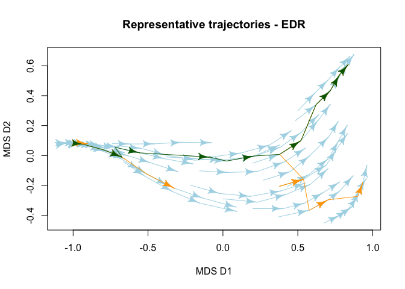
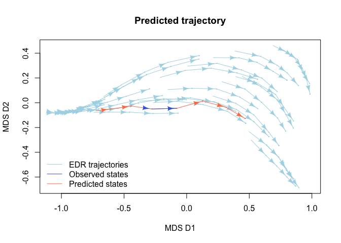

<!-- README.md is generated from README.Rmd. Please edit that file -->

# `ecoregime` </a>

## Analysis of Ecological Dynamic Regimes

<!-- badges: start -->

[](https://CRAN.R-project.org/package=ecoregime)
[](https://cran.r-project.org/package=ecoregime)
<!-- [](https://github.com/MSPinillos/ecoregime/actions/workflows/rhub.yaml) -->
[](https://github.com/MSPinillos/ecoregime/actions/workflows/R-CMD-check.yaml)
<!-- badges: end -->

`ecoregime` implements the EDR framework to characterize and compare
groups of ecological trajectories in multidimensional spaces defined by
ecosystem state variables. The EDR framework was introduced in:

- Sánchez-Pinillos, M., Kéfi, S., De Cáceres, M., Dakos, V. 2023.
  Ecological Dynamic Regimes: Identification, characterization, and
  comparison. *Ecological Monographs*. <doi:10.1002/ecm.1589>

`ecoregime` can be used to assess ecological resilience using ecological
dynamic regimes as the system’s reference. This approach was introduced
in:

- Sánchez-Pinillos M., Dakos, V., Kéfi, S. 2024. Ecological dynamic
  regimes: A key concept for assessing ecological resilience.
  *Biological Conservation*. <doi:10.1016/j.biocon.2023.110409>

`ecoregime` includes functions to forecast ecological trajectories from
ecological dynamic regimes and assess the accuracy of the predictions.
This method was introduced in:

- Sánchez-Pinillos M., Fortin, M-J., Messier, C., Kneeshaw, D. 2026.
  Forecasting ecological trajectories from ecological dynamic regimes to
  improve resilience analysis. *Methods in Ecology and Evolution*.
  <doi:10.1111/2041-210x.70372>

## Installation

You can install `ecoregime` via CRAN:

``` r
install.packages("ecoregime")
```

You can also install the development version of `ecoregime` with:

``` r
# install.packages("devtools")
devtools::install_github("MSPinillos/ecoregime")
```

You can get an overview about its functionality and the workflow of the
EDR framework in the package documentation and vignettes.

``` r
# Force the inclusion of the vignette in the installation
devtools::install_github("MSPinillos/ecoregime", 
                         build_opts = c("--no-resave-data", "--no-manual"),
                         build_vignettes = TRUE)

# Load the package after the installation
library(ecoregime)

# Access the documentation and vignettes
?ecoregime
vignette("EDR_framework", package = "ecoregime")
vignette("Resilience", package = "ecoregime")
vignette("Predicting_trajectories", package = "ecoregime")
```

## Usage

Identify and plot representative trajectories in ecological dynamic
regimes.

``` r
library(ecoregime)

# Calculate state dissimilarities from a matrix of state variables (e.g., species abundances)
variables <- data.frame(EDR_data$EDR3$abundance)
d <- vegan::vegdist(variables[, -c(1:3)])

# Identify the trajectory (or site) and states in d
trajectories <- variables$traj
states <- as.integer(variables$state)

# Compute RETRA-EDR
RT <- retra_edr(d = d, trajectories = trajectories, states = states,
                 minSegs = 5)

# Plot representative trajectories of the EDR
plot(x = RT, d = d, trajectories = trajectories, states = states, select_RT = "T4",
     traj.colors = "lightblue", RT.colors = "orange", sel.color = "darkgreen",
     link.lty = 1, asp = 1, xlab = "MDS D1", ylab = "MDS D2",
     main = "Representative trajectories - EDR")
```



Characterize the internal structure of ecological dynamic regimes
calculating the dispersion (dDis), beta diversity (dBD), and evenness
(dEve) of the individual trajectories.

``` r
# Dynamic dispersion considering trajectory "1" as a reference
dDis(d = d, d.type = "dStates", trajectories = trajectories, states = states, reference = "1")
#> dDis (ref. 1) 
#>     0.4083905

# Dynamic beta diversity
dBD(d = d, d.type = "dStates", trajectories = trajectories, states = states)
#>        dBD 
#> 0.07946371

# Dynamic evenness
dEve(d = d, d.type = "dStates", trajectories = trajectories, states = states)
#>     dEve 
#> 0.842375
```

Compare ecological dynamic regimes.

``` r
# Load species abundances and compile in a data frame
variables1 <- EDR_data$EDR1$abundance
variables2 <- EDR_data$EDR2$abundance
variables3 <- EDR_data$EDR3$abundance
all_variables <- data.frame(rbind(variables1, variables2, variables3))

# Calculate dissimilarities between every pair of states
d <- vegan::vegdist(all_variables[, -c(1:3)])

# Compute dissimilarities between EDRs:
dist_edr(d = d, d.type = "dStates",
         trajectories = all_variables$traj, states = all_variables$state, 
         edr = all_variables$EDR, metric = "dDR", symmetrize = NULL)
#>           1         2         3
#> 1 0.0000000 0.5895458 0.6467200
#> 2 0.5700499 0.0000000 0.2768759
#> 3 0.6317846 0.5050273 0.0000000
```

Assess ecological resilience to pulse disturbances.

``` r
# Species abundances for disturbed communities
disturbed <- EDR_data$EDR3_disturbed$abundance[disturbed_states %in% c(0, 1, 14)]

# Species abundances for disturbed and reference communities
variables$disturbed_states <- 0
disturbed_ref <- rbind(variables, disturbed)

# Calculate dissimilarities between every pair of states
d <- vegan::vegdist(disturbed_ref[, -c(1:3, 16)])

# Use one or more representative trajectories as the reference
RT_ref <- define_retra(RT$T4$Segments)

# Resistance
resistance(d = d, trajectories = disturbed_ref$traj, states = disturbed_ref$state,
           disturbed_trajectories = unique(disturbed$traj),
           disturbed_states = disturbed[disturbed_states == 1]$state)
#>   disturbed_trajectories        Rt
#> 1                     31 0.9578947
#> 2                     32 0.8117647
#> 3                     33 0.6928105

# Amplitude
amplitude(d = d, trajectories = disturbed_ref$traj, states = disturbed_ref$state,
          disturbed_trajectories = unique(disturbed$traj),
          disturbed_states = disturbed[disturbed_states == 1]$state,
          reference = RT_ref)
#>   disturbed_trajectories reference     A_abs     A_rel
#> 1                     31      newT 0.0275000 0.6531250
#> 2                     32      newT 0.1187553 0.6308877
#> 3                     33      newT 0.2675325 0.8709036

# Recovery
recovery(d = d, trajectories = disturbed_ref$traj, states = disturbed_ref$state,
         disturbed_trajectories = unique(disturbed$traj),
         disturbed_states = disturbed[disturbed_states == 1]$state,
         reference = RT_ref)
#>   disturbed_trajectories states reference      Rc_abs     Rc_rel
#> 1                     31     16      newT -0.46424129 -0.6288659
#> 2                     32     17      newT  0.07232084  0.1065781
#> 3                     33     19      newT  0.24753247  0.6885903

# Net change
net_change(d = d, trajectories = disturbed_ref$traj, states = disturbed_ref$state,
           disturbed_trajectories = unique(disturbed$traj),
           disturbed_states = disturbed[disturbed_states == 1]$state,
           reference = RT_ref)
#>   disturbed_trajectories states reference     NC_abs    NC_rel
#> 1                     31     16      newT 0.49174129 0.7357633
#> 2                     32     17      newT 0.04643449 0.1132549
#> 3                     33     19      newT 0.02000000 0.5000000
```

Predict ecological trajectories.

``` r
# State variables for the states in the trajectories forming the EDR
EDR_var <- EDR_data$EDR3$abundance

# State variables of the target
target_var <- EDR_data$EDR3_disturbed$abundance[21:22, paste0("sp", 1:12)]

# Define state_var including the state variables for the states in the EDR and
# the target
state_var <- data.frame(rbind(EDR_var[, -c("EDR", "traj", "state")], target_var))

# Define the function used to calculate state dissimilarities and its arguments
# For example, the Canberra dissimilarity.
d_function = "vegan::vegdist"
d_args = list(x = state_var, method = "bray")

# Compute PETRA-EDR
petra <- petra_edr(state_var = state_var,
                   trajectories = c(EDR_var$traj, "target", "target"),
                   states = as.integer(c(EDR_var$state, 1:2)),
                   targets = "target",
                   k = 5L,
                   minPts = 2L,
                   d_function = d_function,
                   d_args = d_args,
                   return_args = T)

# Mean predicted deviation
MPD(petra)
#>     target 
#> 0.03885392

# Represent the predicted trajectory
plot(x = petra,
     petra.colors = "coral",
     target.colors = "royalblue",
     traj.colors = "lightblue",
     xlab = "MDS D1", ylab = "MDS D2",
     main = "Predicted trajectory")
#> Warning in plot.PETRA(x = petra, petra.colors = "coral", target.colors =
#> "royalblue", : Trajectories will be displayed in an ordination space generated
#> through multidimensional scaling (MDS). You can avoid this step by providing
#> state coordinates in 'coord'.
legend("bottomleft", c("EDR trajectories", "Observed states", "Predicted states"),
       lty = 1, col = c("lightblue", "royalblue", "coral"), bty = "n")
```



## Citation

To cite `ecoregime` in publications use:

Sánchez-Pinillos M, Kéfi S, De Cáceres M, Dakos V (2023). “Ecological
dynamic regimes: Identification, characterization, and comparison.”
*Ecological Monographs*, e1589. <https://doi.org/10.1002/ecm.1589>.

Sánchez-Pinillos M, Dakos V, Kéfi S (2024). “Ecological dynamic regimes:
A key concept for assessing ecological resilience.” *Biological
Conservation*, 110409. <https://doi.org/10.1016/j.biocon.2023.110409>.

Sánchez-Pinillos M, Fortin M, Messier C, Kneeshaw D (2026). “Forecasting
ecological trajectories from ecological dynamic regimes to improve
resilience analysis.” *Methods in Ecology and Evolution*.

Sánchez-Pinillos M (2023). *ecoregime: Analysis of Ecological Dynamic
Regimes*. <https://doi.org/10.5281/zenodo.7584943>.

## Acknowledgements

This project has received funding from the European Union’s Horizon 2020
research and innovation program under the Marie Sklodowska-Curie grant
agreement No 891477 (RESET project) and the Natural Sciences and
Engineering Research Council of Canada (NSERC) \[DIVERSE project;
funding reference ALLRP 583409-23\].
