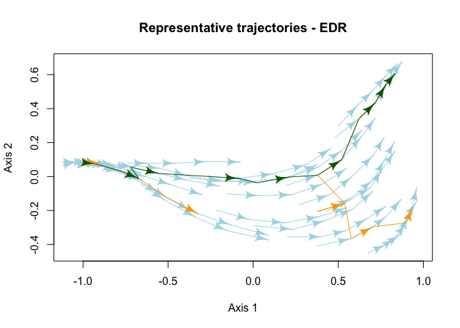

<!-- README.md is generated from README.Rmd. Please edit that file -->

# `ecoregime` </a>

## Analysis of Ecological Dynamic Regimes

<!-- badges: start -->
<!-- badges: end -->

`ecoregime` implements the EDR framework to characterize and compare
groups of ecological trajectories in multidimensional spaces defined by
ecosystem state variables. The EDR framework was introduced in:

Sánchez-Pinillos, M., Kéfi, S., De Cáceres, M., Dakos, V. 2023.
Ecological Dynamic Regimes: Identification, characterization, and
comparison. *Ecological Monographs*
<a href="https://doi.org/10.1002/ecm.####"
class="uri">https://doi.org/10.1002/ecm.####</a>

## Installation

You can install the development version of ecoregime with:

``` r
# install.packages("devtools")
devtools::install_github("MSPinillos/ecoregime")
```

You can get an overview about its functionality and the workflow of the
EDR framework in the package documentation and vignette.

``` r
# Force the inclusion of the vignette in the installation
devtools::install_github("MSPinillos/ecoregime", 
                         build_opts = c("--no-resave-data", "--no-manual"),
                         build_vignettes = TRUE)

# Load the package after the installation
library(ecoregime)

# Access the documentation and vignette
?ecoregime
vignette("EDR_framework", package = "ecoregime")
```

## Usage

Identify and plot representative trajectories in ecological dynamic
regimes.

``` r
library(ecoregime)

# Calculate state dissimilarities from a matrix of species abundances
abundance <- data.frame(EDR_data$EDR1$abundance)
d <- vegan::vegdist(abundance[, -c(1:3)])

# Identify the trajectory (or site) and states in d
trajectories <- abundance$traj
states <- as.integer(abundance$state)

# Compute RETRA-EDR
RT <- retra_edr(d = d, trajectories = trajectories, states = states,
                 minSegs = 5)

# Plot representative trajectories of the EDR
plot(x = RT, d = d, trajectories = trajectories, states = states, select_RT = "T2",
     traj.colors = "lightblue", RT.colors = "orange", sel.color = "darkgreen",
     link.lty = 1, asp = 1, main = "Representative trajectories - EDR")
#> Representative trajectories will be displayed in an ordination space generated through multidimensional scaling (MDS). You can avoid this step by providing state coordinates in the 'd' argument.
```



Characterize the internal structure of ecological dynamic regimes
calculating the dispersion (dDis), beta diversity (dBD), and evenness
(dEve) of the individual trajectories.

``` r
# Dynamic dispersion considering trajectory "1" as a reference
dDis(d = d, d.type = "dStates", trajectories = trajectories, states = states, reference = "1")
#> dDis (ref. 1) 
#>      0.267622

# Dynamic beta diversity
dBD(d = d, d.type = "dStates", trajectories = trajectories, states = states)
#>        dBD 
#> 0.03969095

# Dynamic evenness
dEve(d = d, d.type = "dStates", trajectories = trajectories, states = states)
#>      dEve 
#> 0.7100773
```

Compare ecological dynamic regimes.

``` r
# Load species abundances and compile in a data frame
abun1 <- EDR_data$EDR1$abundance
abun2 <- EDR_data$EDR2$abundance
abun3 <- EDR_data$EDR3$abundance
abun <- data.frame(rbind(abun1, abun2, abun3))

# Calculate dissimilarities between every pair of states
d <- vegan::vegdist(abun[, -c(1:3)])

# Compute dissimilarities between EDRs:
dist_edr(d = d, d.type = "dStates",
                 trajectories = abun$traj, states = abun$state, edr = abun$EDR,
                 metric = "DDR", symmetrize = NULL)
#>           1         2         3
#> 1 0.0000000 0.5895458 0.3458250
#> 2 0.5700499 0.0000000 0.4907364
#> 3 0.4033212 0.6068221 0.0000000
```

## Citation

To cite `ecoregime` in publications use:

Sánchez-Pinillos M, Kéfi S, De Cáceres M, Dakos V (2023). “Ecological
dynamic regimes: Identification, characterization, and comparison.”
*Ecological Monographs*. <a href="https://doi.org/10.1002/ecm.####"
class="uri">https://doi.org/10.1002/ecm.####</a>.

Sánchez-Pinillos M (2023). *ecoregime: Analysis of Ecological Dynamic
Regimes*. <https://doi.org/10.5281/zenodo.7584943>.

## Acknowledgements

This project has received funding from the European Union’s Horizon 2020
research and innovation program under the Marie Sklodowska-Curie grant
agreement No 891477 (RESET project).
