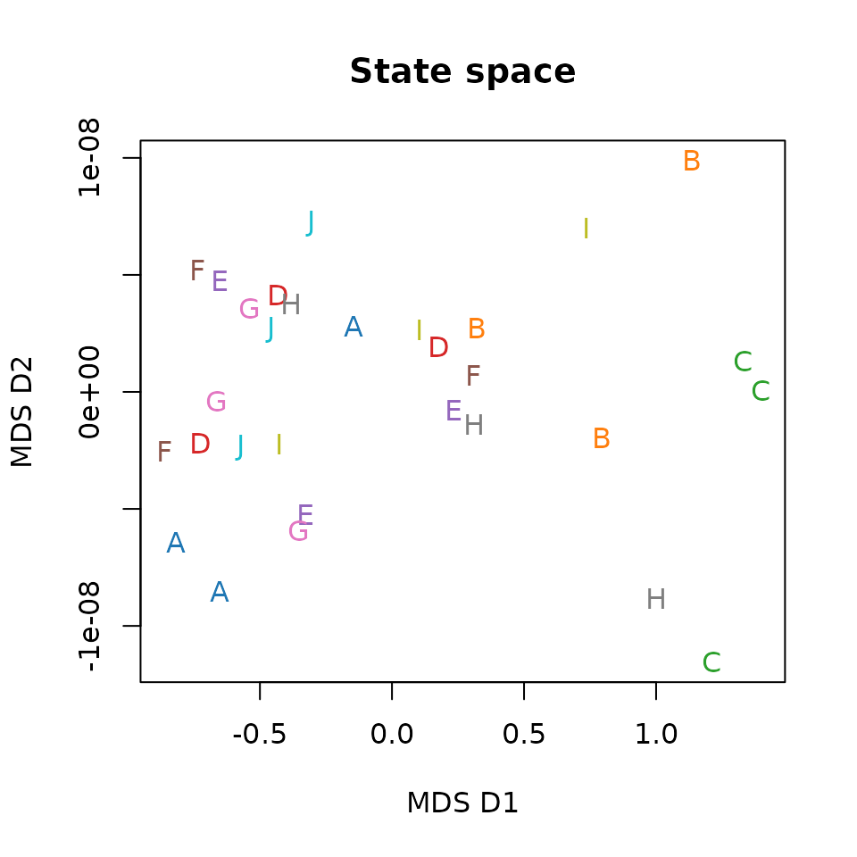
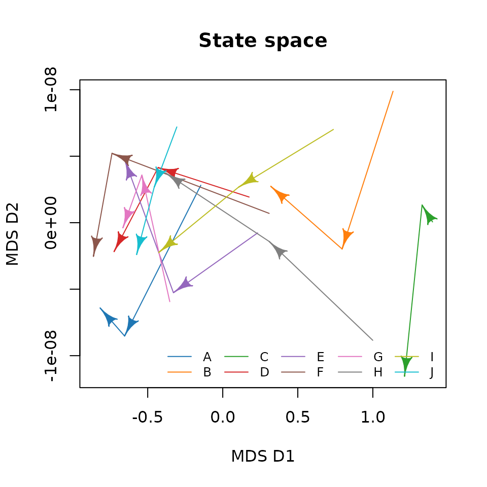
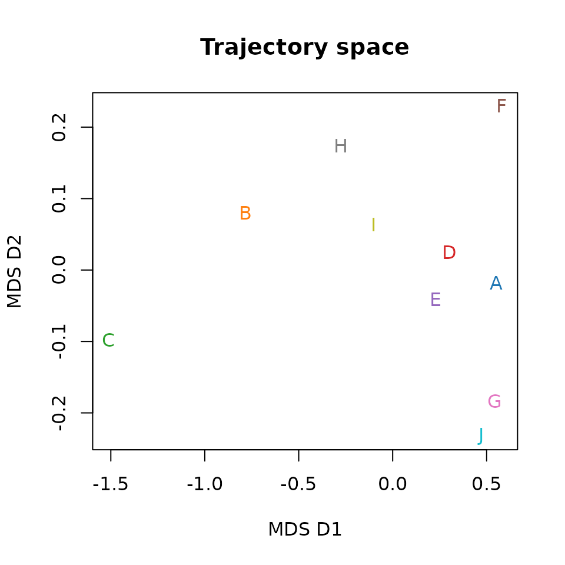
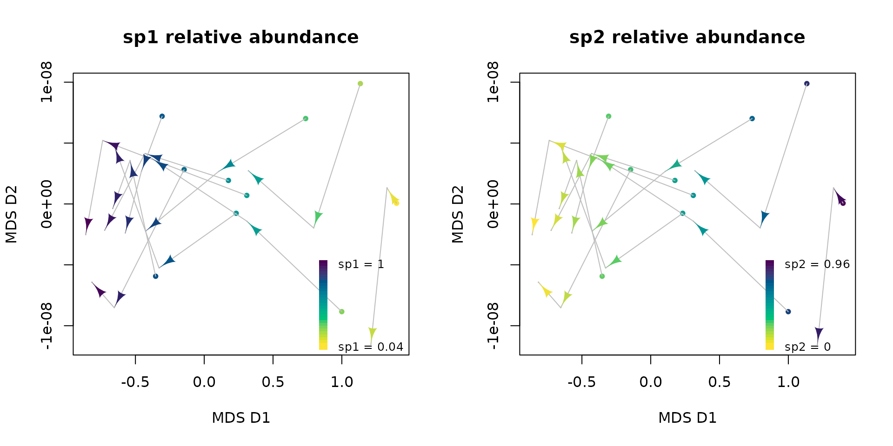
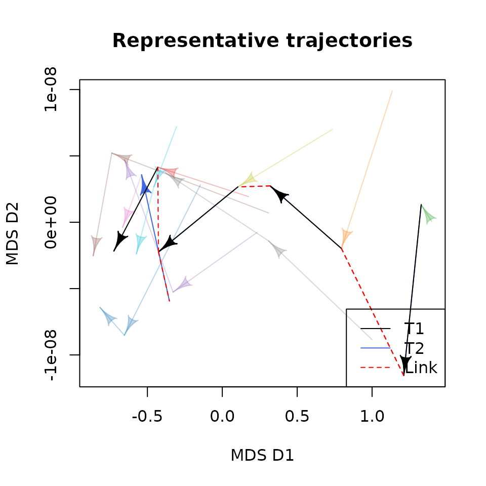
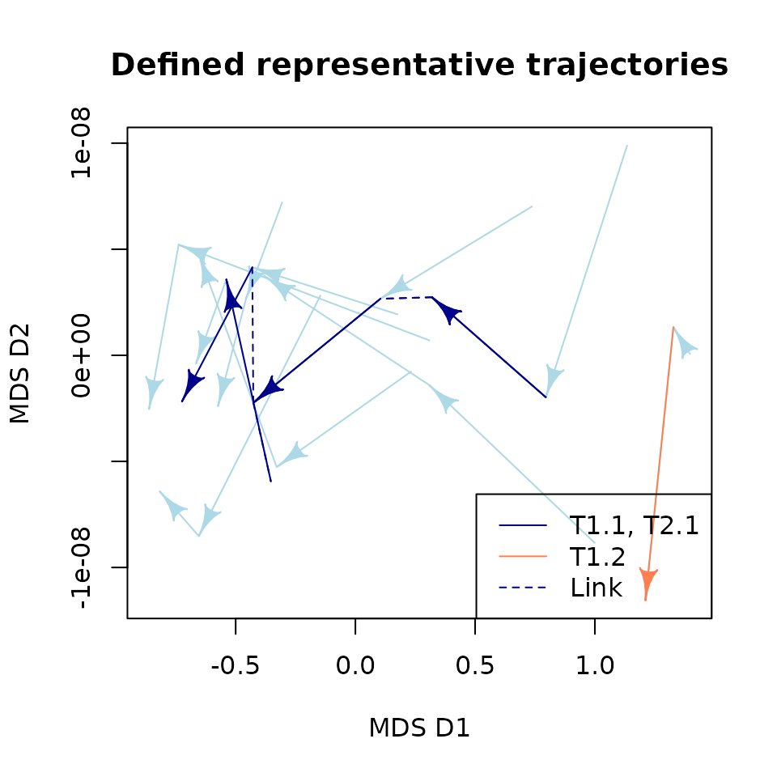
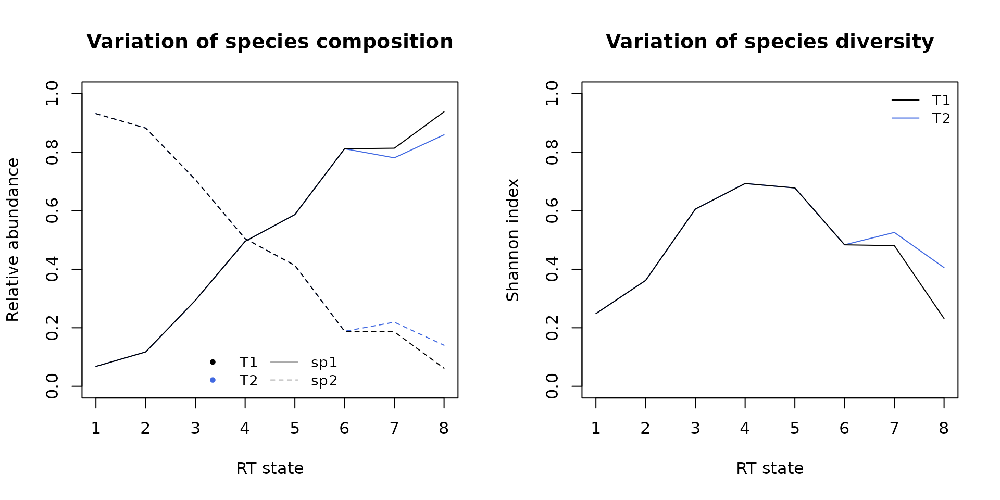
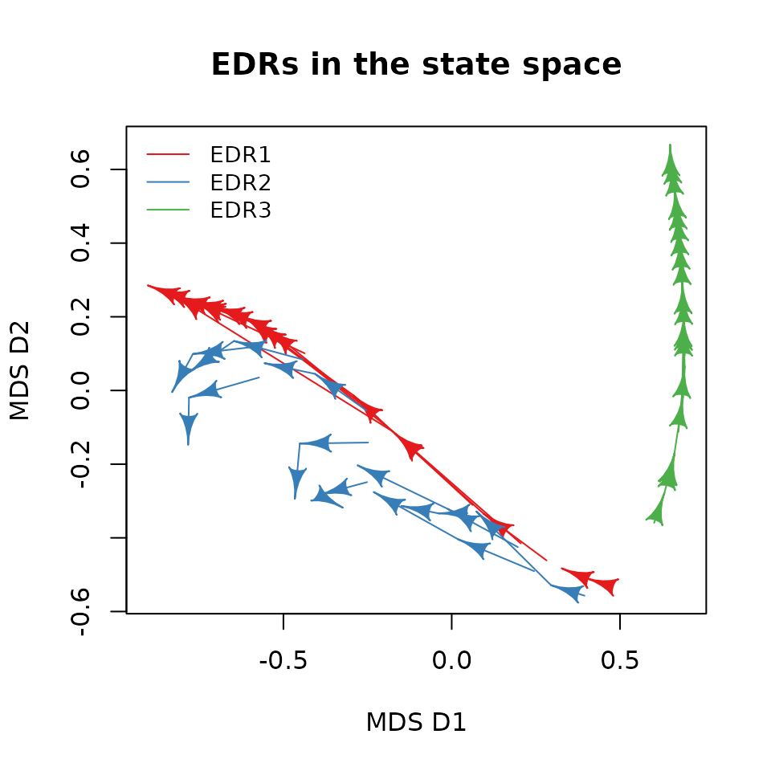

# Ecological Dynamic Regime framework

## 1. Introduction

### 1.1. Ecological Dynamic Regimes and the EDR framework

An **Ecological Dynamic Regime (EDR)** is defined as the *“fluctuations
of ecosystem states around some trend or average resulting from an
intricate mix of internal processes and external forces that, in the
absence of perturbations, keep the system within specific domains of
attraction”* ([Sánchez-Pinillos et al.,
2023](https://doi.org/10.1002/ecm.1589)).

EDRs are composed of multiple ecological trajectories showing similar
processes in the development, interaction, and reorganization of some
state variables over time. Thus, **ecological trajectories** are the
essential units of EDRs and can be defined as sequences of observations
capturing the temporal changes of some state variables. Usually,
ecological trajectories are defined based on multiple state variables
(e.g., species, functional traits, land uses) that make challenging the
characterization and comparison of EDRs.

The **EDR framework** is a set of algorithms and metrics aiming to (1)
characterize and compare EDRs composed of ecological trajectories and
(2) evaluate ecological resilience using EDRs as the reference to assess
the deviation of disturbed ecosystems. For that, the EDR framework uses
multivariate analyses defining multidimensional state spaces.

You can find more information in the following publication, including
the formal definition of the EDR concept, the methodological details of
the framework, and some illustrative examples with artificial and real
data sets:

- Sánchez-Pinillos M., Kéfi, S., De Cáceres, M., Dakos, V. 2023.
  Ecological Dynamic Regimes: Identification, characterization, and
  comparison. *Ecological Monographs*.
  <https://doi.org/10.1002/ecm.1589>

For more details on the evaluation of ecological resilience using
ecological dynamic regimes, you can check
[`vignette("Resilience")`](https://mspinillos.github.io/ecoregime/articles/Resilience.md)
and this publication:

- Sánchez-Pinillos M., Dakos, V., Kéfi, S. 2024. Ecological dynamic
  regimes: A key concept for assessing ecological resilience.
  *Biological Conservation*.
  <https://doi.org/10.1016/j.biocon.2023.110409>

Finally, the EDR framework, can be used to predict ecological
trajectories using a reference EDR
([`vignette("Predicting_trajectories")`](https://mspinillos.github.io/ecoregime/articles/Predicting_trajectories.md)).
Then, the predicted trajectories can be very useful to improve
resilience analyses and detect regime shifts:

- Sánchez-Pinillos M., Fortin, M-J., Messier, C., Kneeshaw, D. 2026.
  Forecasting ecological trajectories from ecological dynamic regimes to
  improve resilience analysis. *Methods in Ecology and Evolution*.
  <https://doi.org/10.1111/2041-210x.70372>

### 1.2. About this vignette

This vignette aims to give you an overview of the EDR framework and its
implementation in `ecoregime` to characterize and compare EDRs.

You can install `ecoregime` directly from CRAN or from my GitHub account
(development version):

``` r

install.packages("ecoregime")
devtools::install_github(repo = "MSPinillos/ecoregime", dependencies = T, build_vignettes = T)
```

Once you have installed `ecoregime` you will have to load it:

``` r

library(ecoregime)
```

``` r

citation("ecoregime")
#> To cite 'ecoregime' in publications use:
#> 
#>   Sánchez-Pinillos M, Kéfi S, De Cáceres M, Dakos V (2023). "Ecological
#>   dynamic regimes: Identification, characterization, and comparison."
#>   _Ecological Monographs_, e1589. <https://doi.org/10.1002/ecm.1589>.
#> 
#>   Sánchez-Pinillos M, Dakos V, Kéfi S (2024). "Ecological dynamic
#>   regimes: A key concept for assessing ecological resilience."
#>   _Biological Conservation_, 110409.
#>   <https://doi.org/10.1016/j.biocon.2023.110409>.
#> 
#>   Sánchez-Pinillos M, Fortin M, Messier C, Kneeshaw D (2026).
#>   "Forecasting ecological trajectories from ecological dynamic regimes
#>   to improve resilience analysis." _Methods in Ecology and Evolution_.
#>   <https://doi.org/10.1111/2041-210x.70372>.
#> 
#>   Sánchez-Pinillos M (2023). _ecoregime: Analysis of Ecological Dynamic
#>   Regimes_. <https://doi.org/10.5281/zenodo.7584943>.
#> 
#> To see these entries in BibTeX format, use 'print(<citation>,
#> bibtex=TRUE)', 'toBibtex(.)', or set
#> 'options(citation.bibtex.max=999)'.
```

## 2. Trajectory data, state and trajectory spaces

If you are familiar with ecological trajectories defined in multivariate
spaces, you can probably skip this section. Otherwise, I recommend you
to read on.

Let me define a simple example that I will use along this vignette.
Imagine that we have 10 sampling units in which we are monitoring the
temporal changes in some state variables. For example, those sampling
units (*A, B, …, J*) could be permanent plots or transects in which we
have inventoried the abundance of two species (*sp1, sp2*) at three
temporal points (*t* = 1, *t* = 2, *t* = 3).

In this example, we will generate some artificial data including
successional trajectories leading to the competitive exclusion of *sp2*
by *sp1* regardless of the initial state. As such, all sampling units
will have analogous trajectories that can be considered part of the same
EDR.

``` r

# ID of the sampling units and observations
ID_sampling <- LETTERS[1:10]
ID_obs <- 1:3

# Define initial species abundances
set.seed(789)
initial <- data.frame(sampling_unit = ID_sampling,
                      sp1 = round(runif(10), 2),
                      sp2 = round(runif(10), 2))

# Simulate artificial dynamics
simulated_abun <- lapply(1:nrow(initial), function(isampling){
  sp1 <- initial$sp1[isampling]
  sp2 <- initial$sp2[isampling]
  while (length(sp1) < 3) {
    set.seed(isampling)
    sp1 <- c(sp1, sp1[length(sp1)]*sample(seq(1, 2, by = 0.01), 1))
    sp2<- c(sp2, sp2[length(sp2)]*sample(seq(0, 1, by = 0.01), 1))
  }
  data.frame(sampling_unit = initial$sampling_unit[isampling],
             time = 1:3, sp1 = sp1/(sp1+sp2), sp2 = sp2/(sp1+sp2))
})

# Compile species abundances of all sampling units in the same data frame
abundance <- do.call(rbind, simulated_abun)
```

We obtain an abundance matrix similar to what we could get from field
data. For each sampling unit (`sampling_unit`) and observation (`time`),
we know the relative abundance of two species (`sp1` and `sp2`).

``` r

head(abundance)
#>   sampling_unit time       sp1        sp2
#> 1             A    1 0.6930693 0.30693069
#> 2             A    2 0.9084551 0.09154492
#> 3             A    3 0.9775843 0.02241569
#> 4             B    1 0.1500000 0.85000000
#> 5             B    2 0.2939297 0.70607029
#> 6             B    3 0.4954633 0.50453667
```

Next, we need to define the **state space** in which ecological
trajectories live. The state space is a multidimensional resemblance
space defined by the dissimilarities between every pair of states (the
observations) in terms of some state variables (the species). That is,
we need to generate a matrix (**\\D_O\\**) representing the state space
and containing the dissimilarities between the observations of all
sampling units.

The choice of the dissimilarity metric used to generate **\\D_O\\**
depends on the characteristics of your data and the nature of the
variables. Your decision should be made carefully since it will affect
the analyses in the EDR framework. In our example, we are using species
abundances. A common dissimilarity metric adequate for that is the
percentage difference (a.k.a. Bray-Curtis index). However, if you have
presence/absence data, you could prefer the Jaccard’s distance, and if
your state variables are categorical (e.g., functional traits), you
should use a multi-trait dissimilarity (e.g., the Gower distance). These
and other ecologically relevant dissimilarity coefficients can be
applied using the function `vegdist()` in `vegan`.

``` r

# Generate a matrix containing dissimilarities between states
state_dissim <- vegan::vegdist(abundance[, c("sp1", "sp2")], method = "bray")
as.matrix(state_dissim)[1:6, 1:6]
#>           1          2          3         4         5         6
#> 1 0.0000000 0.21538578 0.28451500 0.5430693 0.3991396 0.1976060
#> 2 0.2153858 0.00000000 0.06912923 0.7584551 0.6145254 0.4129918
#> 3 0.2845150 0.06912923 0.00000000 0.8275843 0.6836546 0.4821210
#> 4 0.5430693 0.75845508 0.82758431 0.0000000 0.1439297 0.3454633
#> 5 0.3991396 0.61452537 0.68365460 0.1439297 0.0000000 0.2015336
#> 6 0.1976060 0.41299176 0.48212098 0.3454633 0.2015336 0.0000000
```

We can visualize the state space using ordination methods. Here, I apply
multidimensional scaling (mMDS; `smacof`) to the dissimilarity matrix
**\\D_O\\** and plot the distribution of the ecological states in an
ordination space. We will use different colors and the code of the
sampling unit to represent the observations of each sampling unit:

``` r

# Multidimensional scaling
state_mds <- smacof::smacofSym(state_dissim, ndim = 2)
state_mds <- data.frame(state_mds$conf)

# Define different colors for each trajectory
traj.colors <- grDevices::palette.colors(10, palette = "Classic Tableau")

# Plot the distribution of the states in the state space
plot(state_mds$D1, state_mds$D2,
     col = rep(traj.colors, each = 3), # use different colors for each sampling unit
     pch = rep(ID_sampling, each = 3), # use different symbols for each sampling unit
     xlab = "MDS D1", ylab = "MDS D2",
     main = "State space")
```



To see how ecological trajectories are distributed in the state space,
we just need to link the states of each sampling unit in chronological
order.

``` r

# Plot the EDR trajectories in the state space
plot_edr(state_mds, trajectories = abundance$sampling_unit, 
         states = as.integer(abundance$time), 
         traj.colors = traj.colors,
         xlab = "MDS D1", ylab = "MDS D2",
         main = "State space")
legend("bottomright", unique(abundance$sampling_unit), 
       lty = 1, col = traj.colors, ncol = 5, bty = "n", cex = 0.8)
```



The **trajectory space** is a multidimensional space defined by the
dissimilarities between trajectories (i.e., the whole sequence of states
for each sampling unit). Depending on the analyses in which you are
interested, you will not need to compute the trajectory space. I
recommend you to check in advance whether you will need it, since
computing times can be long in big databases. For that, you can check
whether the functions that you eventually want to apply include the
argument `d.type`. If so, it will be useful to have a trajectory
dissimilarity matrix previously calculated.

Analogously to the state space, you need to generate a dissimilarity
matrix (**\\D_T\\**) and the metric that you use will affect the
subsequent analyses. Although there are multiple metrics, there are no
formal analyses evaluating their performance in ecological applications.
Here, I suggest the directed segment path dissimilarity (De Cáceres et
al., 2019, *Ecol. Monogr.*, <https://doi.org/10.1002/ecm.1350>), but you
could use any other dissimilarity metric.

``` r

# Generate a matrix containing dissimilarities between trajectories
traj_dissim <- ecotraj::trajectoryDistances(
  ecotraj::defineTrajectories(state_dissim, 
                              sites = rep(ID_sampling, each = 3),
                              surveys = rep(ID_obs, 10)),
  distance.type = "DSPD"
)

as.matrix(traj_dissim)[1:6, 1:6]
#>           A         B         C          D          E         F
#> A 0.0000000 0.5137586 0.8205982 0.11164445 0.11332269 0.1143568
#> B 0.5137586 0.0000000 0.2391739 0.41903208 0.37581716 0.5494029
#> C 0.8205982 0.2391739 0.0000000 0.73972744 0.69979511 0.8520619
#> D 0.1116444 0.4190321 0.7397274 0.00000000 0.04321492 0.1303708
#> E 0.1133227 0.3758172 0.6997951 0.04321492 0.00000000 0.1735857
#> F 0.1143568 0.5494029 0.8520619 0.13037078 0.17358570 0.0000000
```

In contrast to the state space, in the trajectory space, each trajectory
is represented by one point:

``` r

# Multidimensional scaling
traj_mds <- smacof::smacofSym(traj_dissim, ndim = 2)
traj_mds <- data.frame(traj_mds$conf)

# Plot the distribution of the trajectories in the trajectory space
plot(traj_mds$D1, traj_mds$D2,
     col = traj.colors, # use different colors for each sampling unit
     pch = ID_sampling, # use different symbols for each sampling unit
     xlab = "MDS D1", ylab = "MDS D2",
     main = "Trajectory space")
```



## 3. Defining EDRs

### 3.1. Identifying EDRs from clustering analyses

Identifying EDRs involves finding groups of ecological trajectories
showing dynamic patterns more similar between each other than with any
other ecological trajectory in the trajectory space. In this sense, it
is possible to use the trajectory dissimilarity matrix (**\\D_T\\**) to
identify EDRs through clustering. However, applying clustering analyses
to trajectory data is not always straightforward. Depending on the
characteristics of your data, your goals, and the system that you are
evaluating, the choice of the clustering algorithm may have important
consequences.

Currently, this is out of the scope of `ecoregime` but you can find more
details in the paper introducing the EDR framework [Sánchez-Pinillos et
al., 2023](https://doi.org/10.1002/ecm.1589)

### 3.2. Defining EDRs based on ecological properties

Clustering analyses are not the only way to define EDRs. As I stated
before, the ecological trajectories of our simulated data can be
considered part of the same EDR for having similar dynamic patterns.
Thus, you could define groups of trajectories that you want to evaluate
for sharing similar aspects in the state variables. For example, you
could consider groups of trajectories with the same number of
observations in which the state variables change following similar
patterns.

## 4. Representative trajectories

Regardless of the method used to define EDRs, you can use `ecoregime` to
summarize their dynamics. In our example, it is easy to identify a clear
pattern of competitive exclusion of *sp2* by *sp1*. We can apply the
function
[`plot_edr()`](https://mspinillos.github.io/ecoregime/reference/plot_edr.md)
using species abundances as gradient variables:

``` r

par(mfrow = c(1, 2))
plot_edr(state_mds, trajectories = abundance$sampling_unit, 
         states = as.integer(abundance$time), 
         type = "gradient", variable = abundance$sp1,
         state.colors = hcl.colors(5, "Viridis", rev = T),
         initial = TRUE,
         xlab = "MDS D1", ylab = "MDS D2",
         main = "sp1 relative abundance")
legend("bottomright", 
       legend = c(paste0("sp1 = ", round(max(abundance$sp1), 2)),
                  rep(NA, 28),
                  paste0("sp1 = ", round(min(abundance$sp1), 2))),
       fill = hcl.colors(30, "Viridis"),
       border = NA, y.intersp = 0.2, cex = 0.8, bty = "n")

plot_edr(state_mds, trajectories = abundance$sampling_unit, 
         states = as.integer(abundance$time), 
         type = "gradient", variable = abundance$sp2,
         state.colors = hcl.colors(5, "Viridis", rev = T),
         initial = TRUE,
         xlab = "MDS D1", ylab = "MDS D2",
         main = "sp2 relative abundance")
legend("bottomright", 
       legend = c(paste0("sp2 = ", round(max(abundance$sp2), 2)),
                  rep(NA, 28),
                  paste0("sp2 = ", round(min(abundance$sp2), 2))),
       fill = hcl.colors(30, "Viridis"),
       border = NA, y.intersp = 0.2, cex = 0.8, bty = "n")
```



These analyses are fine for extremely simple systems as the one
simulated in our toy data. However, finding clear dynamical patterns in
empirical data becomes more difficult. In real ecosystems, we usually
have to deal with a great heterogeneity, multiple variables interacting
between each other, and noise. As a consequence, we need robust tools
able to summarize a great variety of trajectories in multidimensional
spaces. That is precisely what RETRA-EDR pursues.

### 4.1. Identifying representative trajectories with RETRA-EDR

**RETRA-EDR (REpresentative TRAjectories in Ecological Dynamic
Regimes)** is an algorithm that aims to identify representative
trajectories in EDRs based on the distribution and density of their
ecological trajectories ([Sánchez-Pinillos et al.,
2023](https://doi.org/10.1002/ecm.1589)). Whereas many algorithms with
similar goals where developed for moving objects in low-dimensional
spaces, RETRA-EDR can be applied to high-dimensional spaces, capturing
the complexity of empirical data.

I will not explain the details of RETRA-EDR in this vignette (you can
find them in [Sánchez-Pinillos et al.,
2023](https://doi.org/10.1002/ecm.1589)), but it is important that you
know its main steps to understand the output returned by
[`retra_edr()`](https://mspinillos.github.io/ecoregime/reference/retra_edr.md):

1.  The ecological trajectories forming the EDR are split into segments.
    Then, a **segment space** analogous to the trajectory space is
    generated from a matrix containing segment dissimilarities.

2.  The segment space is divided into regions with a minimum number of
    trajectory segments (`minSegs`). For that, RETRA-EDR recursively
    divides the space into halves following the axes of the segment
    space and generating a **kd-tree structure**. The greater the
    density of segments in a particular region, the larger the number of
    partitions required until obtaining regions with `minSegs` segments.
    The number of partitions is known as the *depth* of the *k*d-tree
    (`kdTree_depth`) and the number of segments in the final region is
    the `Density`. As such, these indices (`kdTree_depth` and `Density`)
    inform on the how much representative is each observed segment of
    the representative trajectory. Yet, since `Density` is ultimately
    constrained by `minSegs`, `kdTree_depth` is, in general, a better
    indicator.

3.  For each region with at least `minSegs` segments, RETRA-EDR extracts
    the medoid as the **representative segment**.

4.  All representative segments are joined forming a network of
    **representative trajectories**, even if they are not realistic. The
    function
    [`define_retra()`](https://mspinillos.github.io/ecoregime/reference/define_retra.md)
    is useful to redefine representative trajectories and avoid long
    unrealistic links between representative segments or unlikely
    directional changes.

5.  RETRA-EDR returns a set of **attributes characterizing the
    representative trajectories** identified in the EDR, including the
    value of `minSegs`; the sequence of representative segments
    (`Segments`) and the number of states (`Size`) forming each
    representative trajectory; the total length of the trajectory
    (`Length`); the links (`Link`) generated to join representative
    segments and the dissimilarity between the connected states
    (`Distance`); the number of segments in each region represented by
    each representative segment (`Density`), and the number of
    partitions of the segment space until obtaining a region with
    `minSegs` segments or less (`kdTree_depth`).

Let’s apply
[`retra_edr()`](https://mspinillos.github.io/ecoregime/reference/retra_edr.md)
to our data. As the EDR only contains 10 trajectories, we will consider
a low value of `minSegs`.

``` r

# Use set.seed to obtain reproducible results of the segment space in RETRA-EDR
set.seed(123)

# Apply RETRA-EDR
repr_traj <- retra_edr(d = state_dissim, trajectories = rep(ID_sampling, each = 3),
                   states = rep(ID_obs, 10), minSegs = 2)
```

RETRA-EDR has returned two representative trajectories. We can summarize
their attributes using
[`summary()`](https://rdrr.io/r/base/summary.html):

``` r

summary(repr_traj)
#>    ID Size    Length   Avg_link  Sum_link Avg_density Max_density Avg_depth
#> T1 T1    8 0.8702625 0.08988532 0.2696560           3           3      3.00
#> T2 T2    8 0.8538059 0.09963644 0.2989093           3           3      2.75
#>    Max_depth
#> T1         4
#> T2         4
```

In the summary output, we see that both trajectories have similar
properties. Yet, *T1* is slightly longer while the average length of
artificial links is smaller and the average depth of the *k*d-tree
(*Avg_depth*) is larger. *A priori*, we could set *T1* as the main
representative trajectory of the EDR.

The output of
[`retra_edr()`](https://mspinillos.github.io/ecoregime/reference/retra_edr.md)
is an object of class `RETRA`. We can extract specific attributes as we
do with lists.

`Segments` is probably the most important attribute since it informs
about the states that form the representative trajectories.

- *T1* is composed of eight states of four different trajectories (*C*,
  *B*, *I*, and *D*).
- *T2* shares the three first segments with *T1* and diverges towards
  the first segment of trajectory *G*.

``` r

lapply(repr_traj, "[[", "Segments")
#> $T1
#> [1] "C[2-3]" "B[2-3]" "I[2-3]" "D[2-3]"
#> 
#> $T2
#> [1] "C[2-3]" "B[2-3]" "I[2-3]" "G[1-2]"
```

### 4.2. Visualizing representative trajectories in the state space

We can also visualize the representative trajectories in the state space
using the function
[`plot()`](https://rdrr.io/r/graphics/plot.default.html).

``` r

# Plot the representative trajectories of an EDR
plot(repr_traj, # <-- This is a RETRA object returned by retra_edr()
     # data to generate the state space
     d = state_mds, trajectories = rep(ID_sampling, each = 3), states = rep(ID_obs, 10),
     # use the colors previously used for individual trajectories. 
     # (make them more transparent to highlight representative trajectories)
     traj.colors = adjustcolor(traj.colors, alpha.f = 0.3),
     # display representative trajectories in blue    
     RT.colors = "royalblue",
     # select T2 to be displayed with a different color (black)
     select_RT = "T1", sel.color = "black",
     # Identify artificial links using dashed lines (default) and a different color (red)
     link.lty = 2, link.color = "red",
     # We can use other arguments in plot()
     xlab = "MDS D1", ylab = "MDS D2",
     main = "Representative trajectories")

# Add a legend
legend("bottomright", c("T1", "T2", "Link"), 
       col = c("black", "royalblue", "red"), lty = c(1, 1, 2))
```



### 4.3. Defining representative trajectories based on trajectory features

RETRA-EDR returns the longest possible trajectory according to the
procedure defined before. However, you could be interested in only a
fraction of a representative trajectory, split representative
trajectories based on some criteria (e.g. long artificial links), or
maybe, define your own representative trajectory.

Let’s say that we want to split *T1* and *T2* from their first segment
(`"C[2-3]"`) since it has the longest artificial link:

``` r

repr_traj$T1$Link_distance
#>              Link    Distance
#> 1 C[2-3] - B[2-3] 0.176416865
#> 2 B[2-3] - I[2-3] 0.091412448
#> 3 I[2-3] - D[2-3] 0.001826659
```

There are two ways of defining our “new” trajectories using the function
[`define_retra()`](https://mspinillos.github.io/ecoregime/reference/define_retra.md).

The first way consists in providing a list with the sequences of
segments defining each trajectory. This is particularly useful when we
want to select a subset in the output of RETRA-EDR:

``` r

# List including the sequence of segments for each new trajectory
new_traj_ls <- list(
  # Exclude the first segment in T1
  repr_traj$T1$Segments[2:length(repr_traj$T1$Segments)],
  # Exclude the first segment in T2
  repr_traj$T2$Segments[2:length(repr_traj$T2$Segments)],
  # First segment of T1 and T2: segment composed of states 2 and 3 of the sampling unit C ("C[2-3]")
  "C[2-3]"
)

new_traj_ls
#> [[1]]
#> [1] "B[2-3]" "I[2-3]" "D[2-3]"
#> 
#> [[2]]
#> [1] "B[2-3]" "I[2-3]" "G[1-2]"
#> 
#> [[3]]
#> [1] "C[2-3]"
```

The second one consists in providing consists in providing all the
details in a data frame:

``` r

# Generate a data frame indicating the states forming the new trajectories
new_traj_df <- data.frame(
  # name of the new trajectories (as many times as the number of states)
  RT = c(rep("T1.1", 6), rep("T2.1", 6), rep("T1.2", 2)),
  # name of the trajectories (sampling units)
  RT_traj = c(rep("B", 2), rep("I", 2), rep("D", 2), # for the first trajectory (T1.1)
              rep("B", 2), rep("I", 2), rep("G", 2), # for the second trajectory (T2.1)
              rep("C", 2)), # for the third trajectory (T1.2)
  # states in each sampling unit
  RT_states = c(2:3, 2:3, 2:3, # for the first trajectory (T1.1)
                2:3, 2:3, 1:2, # for the second trajectory (T2.1)
                2:3), # for the third trajectory (T1.2)
  # representative trajectories obtained in retra_edr()
  RT_retra = c(rep("T1", 6), rep("T2", 6),
               rep("T1", 2)) # The last segment belong to both (T1, T2), choose one
)

new_traj_df
#>      RT RT_traj RT_states RT_retra
#> 1  T1.1       B         2       T1
#> 2  T1.1       B         3       T1
#> 3  T1.1       I         2       T1
#> 4  T1.1       I         3       T1
#> 5  T1.1       D         2       T1
#> 6  T1.1       D         3       T1
#> 7  T2.1       B         2       T2
#> 8  T2.1       B         3       T2
#> 9  T2.1       I         2       T2
#> 10 T2.1       I         3       T2
#> 11 T2.1       G         1       T2
#> 12 T2.1       G         2       T2
#> 13 T1.2       C         2       T1
#> 14 T1.2       C         3       T1
```

In any case,
[`define_retra()`](https://mspinillos.github.io/ecoregime/reference/define_retra.md)
will return the same output

``` r

# Define representative trajectories using a data frame
new_repr_traj <- define_retra(data = new_traj_df, 
             # Information of the state space
             d = state_dissim, trajectories = rep(ID_sampling, each = 3), 
             states = rep(ID_obs, 10), 
             # RETRA object returned by retra_edr()
             retra = repr_traj)

# Define representative trajectories using a list with sequences of segments
new_repr_traj_ls <- define_retra(data = new_traj_ls, 
             # Information of the state space
             d = state_dissim, trajectories = rep(ID_sampling, each = 3), 
             states = rep(ID_obs, 10), 
             # RETRA object returned by retra_edr()
             retra = repr_traj)

if (all.equal(new_repr_traj, new_repr_traj_ls)) {
  print("Yes, both are equal!")
}
#> [1] "Yes, both are equal!"
```

[`define_retra()`](https://mspinillos.github.io/ecoregime/reference/define_retra.md)
returns an object of class `RETRA` that you can use to plot the new
trajectories:

``` r

plot(new_repr_traj, # <-- This is the RETRA object returned by define_retra()
     # data to generate the state space
     d = state_mds, trajectories = rep(ID_sampling, each = 3), states = rep(ID_obs, 10),
     # display individual trajectories in light blue
     traj.colors = "lightblue",
     # display representative trajectories in dark blue
     RT.colors = "darkblue",
     # select T1.2 to be displayed in a different color (red)
     select_RT = "T1.2", sel.color = "coral",
     # Identify artificial links using dashed lines (default), but use the same
     # color than the representative trajectories (default)
     link.lty = 2, link.color = NULL,
     # We can use other arguments in plot()
     xlab = "MDS D1", ylab = "MDS D2",
     main = "Defined representative trajectories")

# Add a legend
legend("bottomright", c("T1.1, T2.1", "T1.2", "Link"),
       col = c("darkblue", "coral", "darkblue"), lty = c(1, 1, 2))
```



### 4.4. Variation of ecological properties along representative trajectories

The definition of representative trajectories is based on the real
states of the sampling units. Thus, it is possible to assess the
variation of some ecological properties along the representative
trajectories, and therefore, across the EDR.

Let’s see how species composition and species diversity vary along the
representative trajectories returned by
[`retra_edr()`](https://mspinillos.github.io/ecoregime/reference/retra_edr.md)
and, therefore, across the EDR. For that, we need to identify the states
included in both trajectories and calculate the species diversity (e.g.,
Shannon index):

``` r

# Set an ID in the abundance matrix
abundance$ID <- paste0(abundance$sampling_unit, abundance$time)

# Identify the states forming both representative trajectories
traj_states <- lapply(repr_traj, function(iRT){
  segments <- iRT$Segments
  seg_components <- strsplit(gsub("\\]", "", gsub("\\[", "-", segments)), "-")
  traj_states <- vapply(seg_components, function(iseg){
    c(paste0(iseg[1], iseg[2]), paste0(iseg[1], iseg[3]))
  }, character(2))
  traj_states <- unique(as.character(traj_states))
  traj_states <- data.frame(ID = traj_states, RT_states = 1:length(traj_states))
})

sp_comp <- lapply(traj_states, function(iRT){
  data <- merge(iRT, abundance, by = "ID", all.x = T)
  data <- data[order(data$RT_states), ]
  data$Shannon <- vegan::diversity(data[, c("sp1", "sp2")], index = "shannon")
  return(data)
})

sp_comp$T1
#>   ID RT_states sampling_unit time        sp1        sp2   Shannon
#> 3 C2         1             C    2 0.06801831 0.93198169 0.2484825
#> 4 C3         2             C    3 0.11751285 0.88248715 0.3619400
#> 1 B2         3             B    2 0.29392971 0.70607029 0.6056329
#> 2 B3         4             B    3 0.49546333 0.50453667 0.6931060
#> 7 I2         5             I    2 0.58687577 0.41312423 0.6779755
#> 8 I3         6             I    3 0.81190194 0.18809806 0.4834534
#> 5 D2         7             D    2 0.81372860 0.18627140 0.4807711
#> 6 D3         8             D    3 0.93828081 0.06171919 0.2316720
```

Then, we can evaluate the variation of species abundances or other
attributes along the representative trajectories graphically. Here, we
will plot the changes in species composition and species diversity:

``` r

par(mfrow = c(1, 2))
# Plot the variation of sp1 in T2
plot(x = sp_comp$T2$RT_states, y = sp_comp$T2$sp1,
     type = "l", col = "royalblue", ylim = c(0, 1),
     xlab = "RT state", ylab = "Relative abundance",
     main = "Variation of species composition")
# Add the variation of sp1 in T1
lines(x = sp_comp$T1$RT_states, y = sp_comp$T1$sp1,
      col = "black")
# Add the variation of sp2 in T2
lines(x = sp_comp$T2$RT_states, y = sp_comp$T2$sp2,
      col = "royalblue", lty = 2)
# Add the variation of sp2 in T1
lines(x = sp_comp$T1$RT_states, y = sp_comp$T1$sp2,
      col = "black", lty = 2)
# Add a legend
legend("bottom", c("T1", "T2", "sp1", "sp2"), 
       col = c("black", "royalblue", "darkgrey", "darkgrey"), 
       pch = c(20, 20, NA, NA), lty = c(NA, NA, 1, 2), 
       ncol = 2, cex = 0.9, bty = "n")

# Plot the variation of species diversity in T1
plot(x = sp_comp$T2$RT_states, y = sp_comp$T2$Shannon,
     type = "l", col = "royalblue", ylim = c(0, 1),
     xlab = "RT state", ylab = "Shannon index",
     main = "Variation of species diversity")
# Add the variation of species diversity in T2
lines(x = sp_comp$T1$RT_states, y = sp_comp$T1$Shannon,
      col = "black")
# Add a legend
legend("topright", c("T1", "T2"), col = c("black", "royalblue"), 
       lty = 1, cex = 0.9, bty = "n")
```



## 5. Distribution and heterogeneity of ecological trajectories in EDRs

Representative trajectories aim to summarize the main dynamic patterns
of ecological systems in a given EDR. As a complement, you can compute
additional metrics to understand the internal structure of the EDR.

### 5.1. Dynamic dispersion (dDis)

**Dynamic dispersion (dDis)** is calculated as the average dissimilarity
between the trajectories in an EDR and another trajectory taken as a
reference ([Sánchez-Pinillos et al.,
2023](https://doi.org/10.1002/ecm.1589)).

If the trajectory taken as the reference is one of the representative
trajectories (e.g. *T1*), *dDis* can be used as an indicator of its
fitness to the data and as an overall metric of the dispersion of the
trajectories in the EDR.

First, you need to prepare the data. Even if the states of the
representative trajectories are already in your abundance and
dissimilarity matrices, you will need to duplicate them to indicate that
this is a different trajectory. We can directly use the data frame that
we produced to calculate species diversity.

``` r

# Change the trajectory identifier and the number of the state
abundance_T1 <- sp_comp$T1
abundance_T1$sampling_unit <- "T1"
abundance_T1$time <- abundance_T1$RT_states

# Add representative trajectories' data to the abundance matrix
abundance_T1 <- rbind(abundance, abundance_T1[, names(abundance)])

# Calculate state dissimilarities including the representative trajectory
state_dissim_T1 <- vegan::vegdist(abundance_T1[, c("sp1", "sp2")], method = "bray")
```

Now, we can compute dDis using
[`dDis()`](https://mspinillos.github.io/ecoregime/reference/EDR_metrics.md):

``` r

# Compute dDis taking T2 as reference
dDis_T1 <- dDis(d = state_dissim_T1, d.type = "dStates", 
         trajectories = abundance_T1$sampling_unit, states = abundance_T1$time, 
         reference = "T1")
dDis_T1
#> dDis (ref. T1) 
#>      0.1845627
```

Instead of using the representative trajectory as the reference, we
could use any other trajectory of the EDR to quantify how “immersed” it
is in the EDR. Let’s compare *dDis* for trajectories of the sampling
units *D* and *C*. Whereas segments of both trajectories were included
in the representative trajectories, *C* was displayed relatively far
from the rest of trajectories in the state and trajectory spaces.

In this case, we will use the trajectory dissimilarity matrix generated
for the original data:

``` r

# dDis: reference D
dDis_D <- dDis(d = traj_dissim, d.type = "dTraj",
               trajectories = ID_sampling,
               reference = "D")

# dDis: reference C
dDis_C <- dDis(d = traj_dissim, d.type = "dTraj",
               trajectories = ID_sampling,
               reference = "C")

dDis_D
#> dDis (ref. D) 
#>     0.2199374
dDis_C
#> dDis (ref. C) 
#>     0.6508194
```

As expected, the dispersion when trajectory *C* is taken as the
reference is larger than for trajectory *C*, indicating that *C* is more
isolated than *D* within the EDR.

Alternatively, you can weight each trajectory depending on some
criteria. Currently,
[`dDis()`](https://mspinillos.github.io/ecoregime/reference/EDR_metrics.md)
is able to compute *dDis* weighting ecological trajectories by their
size (`w.type = "size"`) and length (`w.type = "length"`). However, if
you want to use different criteria, you can use a set of weights of your
choice (`w.type = "precomputed"`) and indicate them through the
`w.values` argument. For example, imagine that you want to weight each
trajectory by the initial abundance of *sp2*:

``` r

# Define w values
initial_sp2 <- abundance[which(abundance$time == 1), ]$sp2

# Identify the index of the reference trajectories
ind_D <- which(ID_sampling == "D")
ind_C <- which(ID_sampling == "C")

# Compute dDis with weighted trajectories:
# Considering I as reference
dDis_D_w <- dDis(d = traj_dissim, d.type = "dTraj", 
         trajectories = ID_sampling, reference = "D", 
         w.type = "precomputed", w.values = initial_sp2[-ind_D])
# Considering F as reference
dDis_C_w <- dDis(d = traj_dissim, d.type = "dTraj", 
         trajectories = ID_sampling, reference = "C", 
         w.type = "precomputed", w.values = initial_sp2[-ind_C])
dDis_D_w
#> dDis (ref. D) 
#>     0.2946621
dDis_C_w
#> dDis (ref. C) 
#>     0.5815917
```

In comparison with the previous results, *dDis* has increased and
decreased for *D* and *C*, respectively, as a result of the greater
abundance of *sp2* in *C* than in *D*. This result could be interpreted
as a lower isolation of *C* in relation to the trajectories initially
dominated by *sp2*.

Weighting ecological trajectories is equivalent to modifying the
location of the trajectory taken as the reference. Therefore, I do not
recommend you to weight trajectories if the representative trajectory is
the reference of *dDis* because it could make difficult the
interpretation of the results.

### 5.2. Dynamic beta diversity (dBD)

**Dynamic beta diversity (dBD)** was proposed by De Cáceres et
al. (2019; *Ecol. Monogr.*, <https://doi.org/10.1002/ecm.1350>) to
quantify the overall variability of a group of trajectories.
Conceptually, it measures the average distance to the centroid of the
trajectories. Therefore, it is quite similar to *dDis* when it is
calculated taking a representative trajectory as the reference.

*dBD* is implemented in the function
[`dBD()`](https://mspinillos.github.io/ecoregime/reference/EDR_metrics.md).
As you can imagine, *dBD* in our EDR is very small because the dynamical
patterns of all trajectories are very similar.

``` r

# Calculate dBD
dBD(d = state_dissim, d.type = "dStates", 
    trajectories = rep(ID_sampling, each = 3), states = rep(ID_obs, 10))
#>        dBD 
#> 0.07400793
```

### 5.3. Dynamic evenness (dEve)

**Dynamic evenness (dEve)** quantifies the regularity with which an EDR
is filled by ecological trajectories ([Sánchez-Pinillos et al.,
2023](https://doi.org/10.1002/ecm.1589)). This metric informs about the
existence of groups of trajectories within the EDR.

You can compute *dEve* with the function
[`dEve()`](https://mspinillos.github.io/ecoregime/reference/EDR_metrics.md):

``` r

# Calculate dEve
dEve(d = traj_dissim, d.type = "dTraj", trajectories = ID_sampling)
#>      dEve 
#> 0.7718673
```

Like *dDis*, *dEve* can also be calculated using different weights for
the individual trajectories of the EDR. In that case, *dEve* is
equivalent to the functional evenness index proposed by Villéger et
al. (2003; *Ecology*, <https://doi.org/10.1890/07-1206.1>).

For example, weighting ecological trajectories by the initial abundance
of *sp2* is equivalent to reducing the dissimilarity of the trajectories
dominated by *sp2* and *dEve* increases.

``` r

# Calculate dEve weighting trajectories by the initial abundance of sp2
dEve(d = traj_dissim, d.type = "dTraj", trajectories = ID_sampling,
         w.type = "precomputed", w.values = initial_sp2)
#>      dEve 
#> 0.8437734
```

## 6. Comparing EDRs

Representative trajectories and the metrics of dynamic dispersion, beta
diversity, and evenness will allow you to characterize EDRs based on
their dynamic patterns and the distribution of ecological trajectories.
Therefore, you can compare two or more EDRs based on these features,
saying “this EDR is dominated by these dynamics, whereas the dynamics in
this other EDR are different” or “the trajectories in this EDR are more
diverse than in this other EDR”. But what if you want to quantify how
different two EDRs are? This is a common situation. Perhaps, you want to
compare EDRs of ecosystems under different environmental conditions, for
example, forest communities dominated by the same species that grow
under different climatic conditions. Perhaps, you want to use simulated
data to assess the effects of the introduction of certain species in the
EDRs.

Of course, comparing EDR characteristics will provide you with very
valuable information, but if you want “a number”, you will have to
calculate the **dissimilarities between EDRs**. You can do it using
`ecoregime`.

Let’s generate two more EDRs to be compared with the previous one.

We will use the initial states of our first EDR to define the abundances
of *sp1* and *sp2*, but we will introduce a third “invasive” species
(*sp3*).

``` r

# ID of the sampling units for EDR2
initial$sampling_unit <- paste0("inv_", LETTERS[1:10])

# Define initial species abundances for sp3
set.seed(654)
initial$sp3 <- round(runif(10, 0, 0.1), 2)

# Simulate artificial dynamics
simulated_abun2 <- lapply(1:nrow(initial), function(isampling){
  sp1 <- initial$sp1[isampling]
  sp2 <- initial$sp2[isampling]
  sp3 <- initial$sp3[isampling]
  while (length(sp1) < 3) {
    set.seed(isampling)
    sp1 <- c(sp1, sp1[length(sp1)]*sample(seq(0.5, 1, by = 0.01), 1))
    sp2<- c(sp2, sp2[length(sp2)]*sample(seq(0.2, 0.5, by = 0.01), 1))
    sp3<- c(sp3, sp3[length(sp3)]*sample(seq(1.7, 2, by = 0.01), 1))
  }
  data.frame(sampling_unit = initial$sampling_unit[isampling], time = 1:3,
             sp1 = sp1/(sp1+sp2+sp3), sp2 = sp2/(sp1+sp2+sp3), sp3 = sp3/(sp1+sp2+sp3))
})

# Compile species abundances of all sampling units in the same data frame
abundance2 <- do.call(rbind, simulated_abun2)
```

The third EDR will be composed of trajectories dominated by *sp2* and a
new species (*sp4*):

``` r

# ID of the sampling units and observations
ID_sampling3 <- LETTERS[11:20]

# Define initial species abundances
set.seed(987)
initial3 <- data.frame(sampling_units = ID_sampling3,
                       # sp1 = round(runif(10, 0, 0.05), 2),
                       sp4 = round(runif(10, 0, 0.3), 2))

# Simulate artificial dynamics
simulated_abun3 <- lapply(1:nrow(initial), function(isampling){
  # sp1 <- initial3$sp1[isampling]
  sp2 <- initial$sp2[isampling]
  sp4 <- initial3$sp4[isampling]
  while (length(sp2) < 3) {
    set.seed(isampling)
    sp2<- c(sp2, sp2[length(sp2)]*sample(seq(0.8, 1, by = 0.01), 1))
    sp4 <- c(sp4, sp4[length(sp4)]*sample(seq(1, 2, by = 0.01), 1))
  }
  data.frame(sampling_unit = initial3$sampling_unit[isampling],
             time = 1:3, sp2 = sp2/(sp2+sp4), sp4 = sp4/(sp2+sp4))
})

# Compile species abundances of all sampling units in the same data frame
abundance3 <- do.call(rbind, simulated_abun3)
```

Once we have species abundances for all EDRs, we need to calculate
trajectory dissimilarities:

``` r

# Bind all abundance matrices
abundance_allEDR <- data.table::rbindlist(list(abundance, abundance2, abundance3), fill = T)
abundance_allEDR[is.na(abundance_allEDR)] <- 0

# Calculate state dissimilarities including states in the three EDRs
state_dissim_allEDR <- vegan::vegdist(abundance_allEDR[, paste0("sp", 1:4)], method = "bray")

# Calculate trajectory dissimilarities including trajectories in the three EDRs
traj_dissim_allEDR <- ecotraj::trajectoryDistances(
  ecotraj::defineTrajectories(state_dissim_allEDR, 
                              sites = abundance_allEDR$sampling_unit,
                              surveys = abundance_allEDR$time))
```

If we plot the trajectories of all EDRs in a common state space, we can
see that *EDR2* is closer to *EDR1* than *EDR3*. This is not surprising
since all the species in *EDR1* are present in *EDR2*. In contrast,
*EDR3* only has one species in common with the other EDRs.

``` r

# Multidimensional scaling
st_mds_all <- smacof::smacofSym(state_dissim_allEDR, 
                                  ndim = nrow(as.matrix(state_dissim_allEDR))-1)
st_mds_all <- data.frame(st_mds_all$conf)

# Plot ecological trajectories in the state space
state.colorsEDRs <- rep(grDevices::palette.colors(9, palette = "Set 1"), each = 30)
# Set an empty plot
plot(st_mds_all$D1, st_mds_all$D2, type = "n",
     xlab = "MDS D1", ylab = "MDS D2",
     main = "EDRs in the state space")
# Add arrows
for (isampling in seq(1, 90, 3)) {
  # From observation 1 to observation 2
  shape::Arrows(st_mds_all[isampling, 1], st_mds_all[isampling, 2],
         st_mds_all[isampling + 1, 1], st_mds_all[isampling + 1, 2],
         col = state.colorsEDRs[isampling], arr.adj = 1)
  # From observation 2 to observation 3
  shape::Arrows(st_mds_all[isampling + 1, 1], st_mds_all[isampling + 1, 2],
         st_mds_all[isampling + 2, 1], st_mds_all[isampling + 2, 2],
         col = state.colorsEDRs[isampling], arr.adj = 1)
}

# Add a legend
legend("topleft", paste0("EDR", 1:3), col = unique(state.colorsEDRs), 
       lty = 1, cex = 0.9, bty = "n")
```



Let’s see how this is reflected in a dissimilarity matrix generated with
[`dist_edr()`](https://mspinillos.github.io/ecoregime/reference/dist_edr.md):

``` r

# Compute the dissimilarities between EDRs
EDR_dissim <- dist_edr(d = traj_dissim_allEDR, d.type = "dTraj",
                       edr = rep(c("EDR1", "EDR2", "EDR3"), each = 10), 
                       metric = "dDR")
round(EDR_dissim, 2)
#>      EDR1 EDR2 EDR3
#> EDR1 0.00 0.19 0.70
#> EDR2 0.31 0.00 0.71
#> EDR3 0.52 0.57 0.00
```

As expected, the dissimilarity values between *EDR1* and *EDR2* are
smaller than the dissimilarities between *EDR3* and both, *EDR1* and
*EDR2*.

## Acknowledgements

This project has received funding from the European Union’s Horizon 2020
research and innovation program under the Marie Sklodowska-Curie grant
agreement No 891477 (RESET project).
