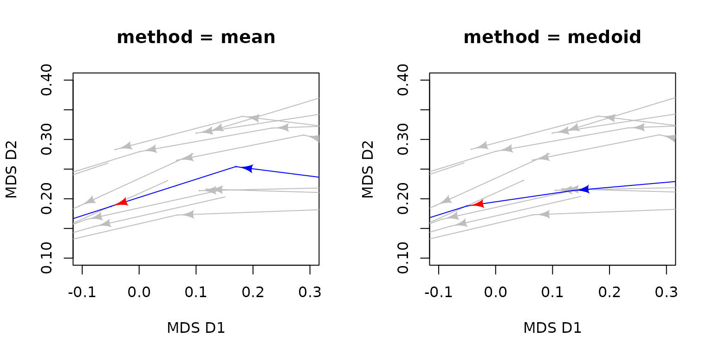
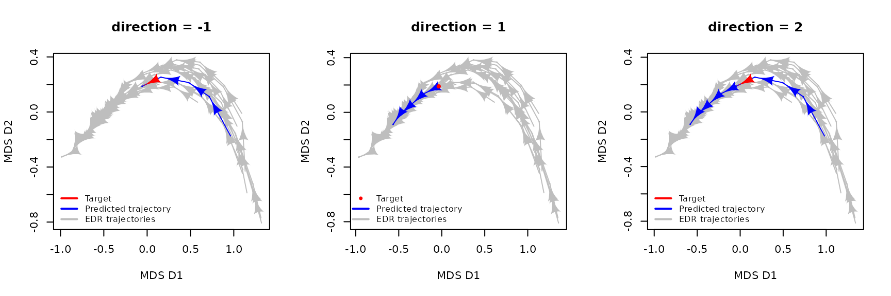
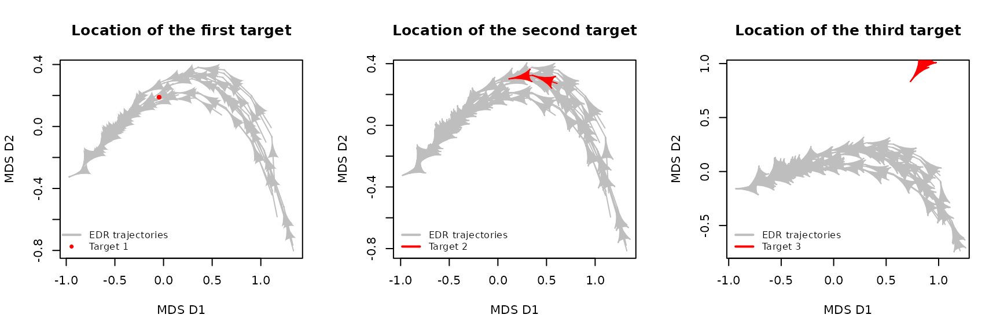

# Predicting ecological trajectories from ecological dynamic regimes

## 1. Introduction

### 1.1. Predicting ecological trajectories within the EDR framework

**Ecological dynamic regimes (EDRs)** are defined as a group of
trajectories reflecting the temporal changes in a set of state variables
under certain external conditions and in the absence of perturbations.
As such, EDRs provide valuable information to infer the dynamics of
analogous systems (i.e., defined by the same state variables) for which
we lack long temporal series.

**PETRA-EDR (*Predicted Ecological TRAjectories in Ecological Dynamic
Regimes***; [Sánchez-Pinillos et al.,
2026](https://doi.org/10.1111/2041-210x.70372)) is an algorithm
implemented in `ecoregime` that leverages ecological dynamic regimes
defined in a multidimensional state space to forecast the unknown
trajectory of any ecosystem state. PETRA-EDR is based on the rationale
that the successional changes in the state variables of ecological
systems under comparable and relatively stable external conditions
follow similar patterns. PETRA-EDR does not aim to outperform other
data-driven and process-based models to forecast ecological dynamics,
but to provide the EDR framework with predictive capacity, improving
ecological resilience analyses, and enabling the detection of dynamic
regime shifts when long time series are unavailable.

In particular, PETRA-EDR can be used to predict the dynamics of a
disturbed system if that disturbance had not occurred. That expected
undisturbed trajectory can then be used as the reference to quantify the
deviation of the disturbed trajectory through amplitude, recovery, and
net change indicators and assess the system’s ecological resilience (see
[`vignette("Resilience")`](https://mspinillos.github.io/ecoregime/articles/Resilience.md)).

Moreover, forecasting the post-disturbance dynamics of a system within a
stability landscape composed of alternative EDRs can be useful to
identify potential regime shifts.

PETRA-EDR is complemented by the metric **MPD (*Mean Predicted
Deviation*)**, which quantifies the prediction accuracy of PETRA-EDR
outputs assuming that, in the absence of stochasticity and observational
noise, there is one and only one ecological trajectory passing by the
target.

To learn more about the technical details of PETRA-EDR and MPD, see this
publication:

- Sánchez-Pinillos M., Fortin, M-J., Messier, C., Kneeshaw, D. 2026.
  Forecasting ecological trajectories from ecological dynamic regimes to
  improve resilience analysis. *Methods in Ecology and Evolution*.
  <https://doi.org/10.1111/2041-210x.70372>

Additional information about the analysis of ecological dynamic regimes
can be found in
[`vignette("EDR_framework")`](https://mspinillos.github.io/ecoregime/articles/EDR_framework.md)
and this publication:

- Sánchez-Pinillos M., Kéfi, S., De Cáceres, M., Dakos, V. 2023.
  Ecological Dynamic Regimes: Identification, characterization, and
  comparison. *Ecological Monographs*.
  <https://doi.org/10.1002/ecm.1589>

To assess ecological resilience using EDRs, you can check
[`vignette("Resilience")`](https://mspinillos.github.io/ecoregime/articles/Resilience.md)
and this publication:

- Sánchez-Pinillos M., Dakos, V., Kéfi, S. 2024. Ecological dynamic
  regimes: A key concept for assessing ecological resilience.
  *Biological Conservation*.
  <https://doi.org/10.1016/j.biocon.2023.110409>

### 1.2. About this vignette

This vignette focuses on the PETRA-EDR algorithm proposed in
[Sánchez-Pinillos et al.,
(2026)](https://doi.org/10.1111/2041-210x.70372) to predict the
ecological trajectories from ecological dynamic regimes. This algorithm
was implemented in the function
[`petra_edr()`](https://mspinillos.github.io/ecoregime/reference/petra_edr.md)
of the R package `ecoregime`. In particular, this vignette introduces
the arguments and outputs of the function
[`petra_edr()`](https://mspinillos.github.io/ecoregime/reference/petra_edr.md),
summarizes the workflow to predict trajectories, quantifies the
prediction accuracy through the metric MPD implemented in
[`MPD()`](https://mspinillos.github.io/ecoregime/reference/MPD.md), and
represents predicted trajectories in a state space using the function
[`plot()`](https://rdrr.io/r/graphics/plot.default.html).

You can install `ecoregime` directly from CRAN or from my GitHub account
(development version):

``` r

install.packages("ecoregime")
devtools::install_github(repo = "MSPinillos/ecoregime", dependencies = T, build_vignettes = T)
```

Once you have installed `ecoregime` you will have to load it:

``` r

library(ecoregime)
```

``` r

citation("ecoregime")
#> To cite 'ecoregime' in publications use:
#> 
#>   Sánchez-Pinillos M, Kéfi S, De Cáceres M, Dakos V (2023). "Ecological
#>   dynamic regimes: Identification, characterization, and comparison."
#>   _Ecological Monographs_, e1589. <https://doi.org/10.1002/ecm.1589>.
#> 
#>   Sánchez-Pinillos M, Dakos V, Kéfi S (2024). "Ecological dynamic
#>   regimes: A key concept for assessing ecological resilience."
#>   _Biological Conservation_, 110409.
#>   <https://doi.org/10.1016/j.biocon.2023.110409>.
#> 
#>   Sánchez-Pinillos M, Fortin M, Messier C, Kneeshaw D (2026).
#>   "Forecasting ecological trajectories from ecological dynamic regimes
#>   to improve resilience analysis." _Methods in Ecology and Evolution_.
#>   <https://doi.org/10.1111/2041-210x.70372>.
#> 
#>   Sánchez-Pinillos M (2023). _ecoregime: Analysis of Ecological Dynamic
#>   Regimes_. <https://doi.org/10.5281/zenodo.7584943>.
#> 
#> To see these entries in BibTeX format, use 'print(<citation>,
#> bibtex=TRUE)', 'toBibtex(.)', or set
#> 'options(citation.bibtex.max=999)'.
```

## 2. Artificial data

First, we will generate three hypothetical targets from the EDR data
included in `ecoregime`. We will use them along the vignette to predict
their trajectories using EDR1 as the reference.

Although the data included in `ecoregime` refer to ecological
communities and species abundances, it is important to note that other
ecological units (e.g., individuals, populations) and state variables
(e.g., number of individuals, functional traits) can be used. Some
examples are detailed in the Supporting Information (Appendix S1) of the
associated paper ([Sánchez-Pinillos et al.,
2026](https://doi.org/10.1111/2041-210x.70372))

``` r

# Matrix including the state variables (sp1-sp12) of the EDR trajectories
edr <- EDR_data$EDR1$abundance

# The first target is composed of one state resulting from averaging the state
# variables of two states in the reference EDR
target1 <- data.frame(matrix(colMeans(edr[traj == 3 & state %in% 1:2, paste0('sp', 1:12)]),
                             ncol = 12, 
                             dimnames = list(1, paste0('sp', 1:12))))
target1$traj <- 'target1'
target1$state <- 1

# The second target is composed of three states resulting from averaging the 
# state variables of four states in the reference EDR
target2 <- data.frame(t(sapply(1:3, function(istate){
  matrix(colMeans(edr[traj == 6 & state %in% istate:(istate+1), 
                      paste0('sp', 1:12)]))
})))
names(target2) <- paste0('sp', 1:12)
target2$traj <- 'target2'
target2$state <- 1:3

# For the third target, we will consider a trajectory of a different EDR
target3 <- EDR_data$EDR2$abundance[1:5, 3:ncol(EDR_data$EDR2$abundance)]
target3$traj <- 'target3'
```

## 3. Understanding `petra_edr()`

### 3.1. The arguments of `petra_edr()`

We can classify the arguments of
[`petra_edr()`](https://mspinillos.github.io/ecoregime/reference/petra_edr.md)
into four main groups:

- Arguments to define the state variables and identify trajectories and
  states: *state_var, trajectories, states, targets*

- Arguments to define the state space: *d_function, d_args, d*

- Parameters of PETRA-EDR: *k, eps, minPts, w_function, alpha, w,
  method, direction*

- Arguments to define the contents of the output: *return_args*

Let’s use the first target defined in the previous section as an example
to better understand the arguments of
[`petra_edr()`](https://mspinillos.github.io/ecoregime/reference/petra_edr.md).

- **Arguments to define the state variables and identify EDR
  trajectories, states, and targets:**

  - `state_var`: the state variables of each EDR and target state. In
    our example, `state_var` is a `data.frame` including the species
    abundances for all states in the EDR and the target:

``` r

# Select the columns containing the state variables (sp1, ..., sp12) and 
# include the information of EDR and target states in the same data.frame 
state_var1 <- data.frame(rbind(edr[, paste0("sp", 1:12)], 
                               target1[, paste0("sp", 1:12)]))
head(state_var1)
#>   sp1 sp2 sp3 sp4 sp5 sp6 sp7 sp8 sp9 sp10 sp11 sp12
#> 1  61   4   4   4   4   3   4   3   4    4    2    3
#> 2  66   4   4   4   3   2   3   3   4    4    2    3
#> 3  69   3   3   3   3   2   3   2   3    3    2    2
#> 4  73   3   3   3   2   2   3   2   3    3    2    2
#> 5  76   2   3   2   2   2   2   2   2    2    2    2
#> 6   2  16  29  24   4   1   5   1   6   11    0    2
```

- `trajectories`: the ID of all trajectories or sites, including both
  the EDR trajectories and the targets.

``` r

trajectories1 <- c(edr$traj, target1$traj)
head(trajectories1)
#> [1] "1" "1" "1" "1" "1" "2"
```

- `states`: the ID of all states or surveys, including both the EDR
  states and the target states.

``` r

states1 <- as.integer(c(edr$state, target1$state))
head(states1)
#> [1] 1 2 3 4 5 1
```

- `targets`: the ID of the targets for which we want to predict their
  dynamics. In our example, `"target1"`.

- **Arguments to define the state space:** In the EDR framework, the
  state space is defined by a dissimilarity matrix.
  [`petra_edr()`](https://mspinillos.github.io/ecoregime/reference/petra_edr.md)
  needs to recalculate the state space as it advances predicting new
  states. As a consequence, we need to indicate the function used to
  define the state space and a list of arguments to apply the
  dissimilarity function:

  - `d_function`: name of the function used to compute the state
    dissimilarity matrix in the form `"package::function"` (e.g.,
    `"vegan::vegdist"`). It is important to consider a function
    returning an object of class `dist`.

  - `d_args`: a list of arguments needed to apply `d_function`. This
    list depends on `d_function`, for example, in the function `vegdist`
    in `vegan`, the minimum argument that we need to specify is `x`
    (i.e., the community data matrix, which in our case is `state_var`).
    If we want to modify the other arguments of the function, we will
    have to include it in `d_args`. For example, to apply the
    Bray-Curtis dissimilarity, we need to include de argument `method`
    in `d_args`. Thus, in this example, we would define
    `d_args = list(x = state_var, method = 'bray')`.

  - `d`: we can include a matrix containing the dissimilarities between
    each pair of states in the EDR and targets in the same order than
    the specified in `trajectories` and `states`. In our example, `d`
    can be calculated by applying `d_function` to `state_var`. If `d` is
    not specified,
    [`petra_edr()`](https://mspinillos.github.io/ecoregime/reference/petra_edr.md)
    will compute it using the arguments `d_function` and `d_args`.

``` r

# Compute state dissimilarities from state_var
dStates1 <- vegan::vegdist(x = state_var1, method = "bray")
```

- **Parameters of PETRA-EDR**: These parameters are specific of the
  PETRA-EDR algorithm. You can find useful information in
  [Sánchez-Pinillos et al.,
  (2026)](https://doi.org/10.1111/2041-210x.70372) and its Supporting
  Information (Appendix S1).

  - `k`: number of the nearest states to the target. Small values of `k`
    returns forecasts highly dependent on the nearest trajectories,
    whereas large values consider the trends of many trajectories in the
    EDR. Let’s see the differences of applying
    [`petra_edr()`](https://mspinillos.github.io/ecoregime/reference/petra_edr.md)
    in our example when `k = 2L` and `k = 20L`:

``` r

# Compute petra_edr using a small k
petra_k1 <- petra_edr(state_var = state_var1, 
                      trajectories = trajectories1,
                      states = states1, 
                      targets = "target1",
                      d_function = "vegan::vegdist", 
                      d_args = list(x = state_var1, method = "bray"),
                      k = 2L,
                      minPts = 2L,
                      return_args = T)

# Compute petra_edr using a large k
petra_k2 <- petra_edr(state_var = state_var1, 
                      trajectories = trajectories1,
                      states = states1, 
                      targets = "target1",
                      d_function = "vegan::vegdist", 
                      d_args = list(x = state_var1, method = "bray"),
                      k = 20L,
                      minPts = 2L,
                      return_args = T)

# Use plot to see the results
par(mfrow = c(1, 2))
plot(x = petra_k1, 
     target.colors = "red", 
     petra.colors = "blue", 
     xlab = "MDS D1", 
     ylab = "MDS D2", 
     main = "k = 2")
legend("bottomleft", 
       c("Target", "Predicted trajectory", "EDR trajectories"), 
       lwd = 2,
       col = c("red", "blue", "grey"), 
       cex = 0.8, 
       bty = "n")

plot(x = petra_k2, 
     target.colors = "red", 
     petra.colors = "blue", 
     xlab = "MDS D1", 
     ylab = "MDS D2", 
     main = "k = 20")
legend("bottomleft", 
       c("Target", "Predicted trajectory", "EDR trajectories"), 
       lwd = 2, 
       col = c("red", "blue", "grey"), 
       cex = 0.8, 
       bty = "n")
```


When `k = 2L`,
[`petra_edr()`](https://mspinillos.github.io/ecoregime/reference/petra_edr.md)
selects two states that are very close to the target:

``` r

petra_k1$k_dist
#>     target target_state k_trajectories k_states k_dist
#>     <char>        <int>         <char>    <int>  <num>
#> 1: target1            1              9        2  0.025
#> 2: target1            1             16        2  0.025
```

In contrast, when `k = 20L`,
[`petra_edr()`](https://mspinillos.github.io/ecoregime/reference/petra_edr.md)
selects 20 states being the furthest state at a dissimilarity larger
than 0.07:

``` r

tail(petra_k2$k_dist)
#>     target target_state k_trajectories k_states     k_dist
#>     <char>        <int>         <char>    <int>      <num>
#> 1: target1            1              6        5 0.06965174
#> 2: target1            1              9        1 0.06965174
#> 3: target1            1             15        1 0.06965174
#> 4: target1            1             20        1 0.06965174
#> 5: target1            1             10        1 0.07425743
#> 6: target1            1             12        2 0.07425743
```

While setting `k=20L` returns a longer trajectory, the predicted
trajectory has a greater uncertainty, since it can be biased by the
furthest states.

- `eps`: dissimilarity threshold beyond which EDR states are disregarded
  in the computation of the predicted trajectories. This argument can be
  used to avoid biased outputs due to far states.

``` r

# Compute petra_edr using a small eps
petra_eps1 <- petra_edr(state_var = state_var1, 
                        trajectories = trajectories1, 
                        states = states1,
                        targets = "target1",
                        d_function = "vegan::vegdist", 
                        d_args = list(x = state_var1, method = "bray"),
                        k = 20L, 
                        minPts = 2L, 
                        eps = 0.03, 
                        return_args = T)

# Compute petra_edr using a large eps
petra_eps2 <- petra_edr(state_var = state_var1, 
                        trajectories = trajectories1, 
                        states = states1, 
                        targets = "target1",
                        d_function = "vegan::vegdist", 
                        d_args = list(x = state_var1, method = "bray"),
                        k = 20L, 
                        minPts = 2L, 
                        eps = 0.1, 
                        return_args = T)

# Plot PETRA outputs
par(mfrow = c(1, 2))
plot(x = petra_eps1, 
     target.colors = "red", 
     petra.colors = "blue", 
     xlab = "MDS D1", 
     ylab = "MDS D2", 
     main = "eps = 0.03")
legend("bottomleft", 
       c("Target", "Predicted trajectory", "EDR trajectories"), 
       lwd = 2,
       col = c("red", "blue", "grey"), 
       cex = 0.8, 
       bty = "n")

plot(x = petra_eps2, 
     target.colors = "red", 
     petra.colors = "blue", 
     xlab = "MDS D1", 
     ylab = "MDS D2", 
     main = "eps = 0.1")
legend("bottomleft", 
       c("Target", "Predicted trajectory", "EDR trajectories"), 
       lwd = 2,
       col = c("red", "blue", "grey"), 
       cex = 0.8, 
       bty = "n")
```


Even if we specify `k = 20L`, we can restrict the number of selected
states to those within a radius `eps` from the target states. For
example, when we set `eps = 0.03`, only three out of the 20 states are
used in the analyses:

``` r

petra_eps1$k_dist
#>     target target_state k_trajectories k_states     k_dist
#>     <char>        <int>         <char>    <int>      <num>
#> 1: target1            1              9        2 0.02500000
#> 2: target1            1             16        2 0.02500000
#> 3: target1            1             10        2 0.02985075
```

- `minPts`: minimum number of states required to calculate the predicted
  states. In general, smaller values of `minPts` lead to longer
  predicted trajectories. However, the states calculated from a small
  number of states could be associated with a higher uncertainty.

``` r

# Compute petra_edr using a small minPts
petra_minPts1 <- petra_edr(state_var = state_var1, 
                           trajectories = trajectories1, 
                           states = states1,
                           targets = "target1",
                           d_function = "vegan::vegdist", 
                           d_args = list(x = state_var1, method = "bray"),
                           k = 6L, 
                           minPts = 2L, 
                           return_args = T)

# Compute petra_edr using a large minPts
petra_minPts2 <- petra_edr(state_var = state_var1, 
                           trajectories = trajectories1, 
                           states = states1,
                           targets = "target1",
                           d_function = "vegan::vegdist", 
                           d_args = list(x = state_var1, method = "bray"),
                           k = 6L, 
                           minPts = 6L, 
                           return_args = T)

# Plot PETRA outputs
par(mfrow = c(1, 2))
plot(x = petra_minPts1, 
     target.colors = "red", 
     petra.colors = "blue", 
     xlab = "MDS D1", 
     ylab = "MDS D2", 
     main = "minPts = 2")
legend("bottomleft", 
       c("Target", "Predicted trajectory", "EDR trajectories"), 
       lwd = 2,
       col = c("red", "blue", "grey"), 
       cex = 0.8, 
       bty = "n")

plot(x = petra_minPts2, 
     target.colors = "red", 
     petra.colors = "blue", 
     xlab = "MDS D1", 
     ylab = "MDS D2", 
     main = "minPts = 10")
legend("bottomleft", 
       c("Target", "Predicted trajectory", "EDR trajectories"), 
       lwd = c(NA, 2, 2), 
       pch = c(20, NA, NA),
       col = c("red", "blue", "grey"), 
       cex = 0.8, 
       bty = "n")
```


When we set `minPts = 2L`,
[`petra_edr()`](https://mspinillos.github.io/ecoregime/reference/petra_edr.md)
returns five predicted states, two of them calculated from four and two
EDR states, respectively. In contrast, by setting `minPts = 6L`, we
ensured that all predicted states are calculated from six or more EDR
states, indicating a higher probability of finding those state variables
in nature:

``` r

petra_minPts1$predicted_dist[, c("target", "predicted_state", "N")]
#>     target predicted_state     N
#>     <char>           <num> <int>
#> 1: target1               0     4
#> 2: target1               2     6
#> 3: target1               3     6
#> 4: target1               4     6
#> 5: target1               5     2
petra_minPts2$predicted_dist[, c("target", "predicted_state", "N")]
#>     target predicted_state     N
#>     <char>           <num> <int>
#> 1: target1               2     6
#> 2: target1               3     6
#> 3: target1               4     6
```

- `w_function`: instead of using the argument `eps`, we can assign
  different weights as a function of the dissimilarity of the target to
  the EDR states to improve the results.
  [`petra_edr()`](https://mspinillos.github.io/ecoregime/reference/petra_edr.md)
  permits using six different weighting functions: `"linear"`,
  `"power"`, `"exponential"`, `"Gaussian"`, `"hyperbolic"`, or
  `"spherical"`. You can see the relevance of this argument in
  [Sánchez-Pinillos et al.,
  (2026)](https://doi.org/10.1111/2041-210x.70372).
- `alpha`: when `w_function` is one of `"power"`, `"exponential"`, or
  `"hyperbolic"`, `alpha` is the parameter modulating the shape of these
  functions.
- `w`: it is possible to assign different weights using some values
  pre-defined by the user. For example, one could be interested in
  defining `w` depending on some external variables.
- `method`: it indicates how the predicted states are calculated.

``` r

# Compute petra_edr using method = "mean"
petra_method1 <- petra_edr(state_var = state_var1, 
                           trajectories = trajectories1, 
                           states = states1,
                           targets = "target1",
                           d_function = "vegan::vegdist", 
                           d_args = list(x = state_var1, method = "bray"),
                           k = 20L, 
                           minPts = 2L, 
                           method = "mean",
                           return_args = T)

# Compute petra_edr using method = "medoid"
petra_method2 <- petra_edr(state_var = state_var1, 
                           trajectories = trajectories1, 
                           states = states1, 
                           targets = "target1",
                           d_function = "vegan::vegdist", 
                           d_args = list(x = state_var1, method = "bray"),
                           k = 20L, 
                           minPts = 2L, 
                           method = "medoid",
                           return_args = T)
```

If `method = "mean"`, the predicted states are calculated averaging the
state variables of the EDR states. If `method = "medoid"`, the predicted
states coincide with the medoids of the EDR states. We can zoom in one
of the predicted states to see the differences between both methods:

``` r

par(mfrow = c(1, 2))
plot(petra_method1, 
     target.colors = "red", 
     petra.colors = "blue", 
     xlim = c(-0.1, 0.3), 
     ylim = c(0.1, 0.4),
     xlab = "MDS D1", 
     ylab = "MDS D2", 
     main = "method = mean")

plot(petra_method2, 
     target.colors = "red", 
     petra.colors = "blue", 
     xlim = c(-0.1, 0.3), 
     ylim = c(0.1, 0.4),
     xlab = "MDS D1", 
     ylab = "MDS D2", 
     main = "method = medoid")
```



- `direction`: we can specify whether we want to predict the dynamics
  before and/or after the target.

``` r

# Compute petra_edr before the target
petra_direction1 <- petra_edr(state_var = state_var1, 
                              trajectories = trajectories1, 
                              states = states1, 
                              targets = "target1",
                              d_function = "vegan::vegdist", 
                              d_args = list(x = state_var1, method="bray"),
                              k = 20L, 
                              minPts = 2L, 
                              direction = -1, 
                              return_args = T)

  # Compute petra_edr after the target
petra_direction2 <- petra_edr(state_var = state_var1, 
                              trajectories = trajectories1, 
                              states = states1, 
                              targets = "target1",
                              d_function = "vegan::vegdist", 
                              d_args = list(x = state_var1, method="bray"),
                              k = 20L, 
                              minPts = 2L, 
                              direction = 1, 
                              return_args = T)

  # Compute petra_edr before and after the target
petra_direction3 <- petra_edr(state_var = state_var1, 
                              trajectories = trajectories1, 
                              states = states1, 
                              targets = "target1",
                              d_function = "vegan::vegdist", 
                              d_args = list(x = state_var1, method="bray"),
                              k = 20L, 
                              minPts = 2L, 
                              direction = 2,
                              return_args = T)

  # Plot PETRA outputs
par(mfrow = c(1, 3))
plot(x = petra_direction1, 
     target.colors = "red", 
     petra.colors = "blue", 
     xlab = "MDS D1", 
     ylab = "MDS D2", 
     main = "direction = -1")
legend("bottomleft", 
       c("Target", "Predicted trajectory", "EDR trajectories"), 
       lwd = 2,
       col = c("red", "blue", "grey"), 
       cex = 0.8, 
       bty = "n")

plot(x = petra_direction2, 
     target.colors = "red", 
     petra.colors = "blue", 
     xlab = "MDS D1", 
     ylab = "MDS D2", 
     main = "direction = 1")
legend("bottomleft", 
       c("Target", "Predicted trajectory", "EDR trajectories"), 
       lwd = c(NA, 2, 2), 
       pch = c(20, NA, NA),
       col = c("red", "blue", "grey"), 
       cex = 0.8, 
       bty = "n")

plot(x = petra_direction3, 
     target.colors = "red", 
     petra.colors = "blue", 
     xlab = "MDS D1", 
     ylab = "MDS D2", 
     main = "direction = 2")
legend("bottomleft", 
       c("Target", "Predicted trajectory", "EDR trajectories"), 
       lwd = 2,
       col = c("red", "blue", "grey"), 
       cex = 0.8, 
       bty = "n")
```



- **Argument to define the contents of the output**

  - `return_args`: if `TRUE`, the output contains the information
    included in the arguments of
    [`petra_edr()`](https://mspinillos.github.io/ecoregime/reference/petra_edr.md).
    This is essential for computing other functions, like
    [`plot()`](https://rdrr.io/r/graphics/plot.default.html) or
    [`MPD()`](https://mspinillos.github.io/ecoregime/reference/MPD.md).

### 3.2. The outputs of `petra_edr()`

[`petra_edr()`](https://mspinillos.github.io/ecoregime/reference/petra_edr.md)
returns a list of elements including the state variables of the
predicted trajectory and some statistics associated with the targets and
the predicted states.

- `state_var`: element of the same class than the argument `state_var`
  including the state variables for all states in the predicted
  trajectory.

``` r

petra_k2$state_var
#>        sp1       sp2       sp3       sp4      sp5      sp6      sp7      sp8
#> 1  6.00000 17.000000 20.800000 16.200000 4.400000 1.600000 6.200000 2.200000
#> 2 12.00000 13.428571 14.857143 13.000000 5.857143 2.285714 7.857143 3.428571
#> 3 19.00000 11.125000 11.750000 10.750000 6.000000 2.875000 7.750000 4.125000
#> 4 29.46154  8.692308  9.153846  8.615385 5.846154 3.307692 7.153846 4.615385
#> 5 38.00000  7.500000  7.500000  7.500000 5.500000 3.000000 6.500000 4.500000
#> 6 44.33333  6.333333  6.466667  6.266667 4.866667 3.066667 5.466667 4.066667
#> 7 50.46154  5.538462  5.615385  5.538462 4.153846 2.846154 4.846154 3.769231
#> 8 56.08333  4.833333  4.833333  4.833333 4.000000 2.666667 4.333333 3.416667
#> 9 59.71429  4.428571  4.428571  4.428571 4.000000 2.285714 4.000000 3.142857
#>        sp9      sp10     sp11     sp12
#> 1 8.200000 13.200000 1.200000 2.600000
#> 2 9.428571 12.142857 2.142857 4.000000
#> 3 8.750000 10.625000 2.250000 4.375000
#> 4 7.461538  8.461538 2.923077 4.461538
#> 5 6.500000  7.500000 3.000000 4.000000
#> 6 5.733333  6.200000 2.866667 3.800000
#> 7 5.307692  5.461538 2.692308 3.615385
#> 8 4.416667  4.750000 2.500000 3.500000
#> 9 4.000000  4.428571 2.285714 3.142857
```

- `trajectories` and `states`: these elements are useful to identify the
  trajectory and state ID of the predicted trajectory in `state_var`.

In our example, as we only used one target, `trajectories` indicate that
all rows in `state_var` refer to target1. This output is, however,
useful when we include several targets in
[`petra_edr()`](https://mspinillos.github.io/ecoregime/reference/petra_edr.md)
as we will see later.

``` r

petra_k2$trajectories
#> [1] "target1" "target1" "target1" "target1" "target1" "target1" "target1"
#> [8] "target1" "target1"
```

`states` shows the order of the predicted states. In this case, target1
contains only one state, which is identified by `1`. The states `-3:0`
and `2:5` correspond to the predicted states preceding and following the
target, respectively.

``` r

petra_k2$states
#> [1] -3 -2 -1  0  1  2  3  4  5
```

`trajectories` and `states` serve to identify the states in `state_var`:

``` r

state_var1_k2 <- petra_k2$state_var
state_var1_k2$traj <- petra_k2$trajectories
state_var1_k2$state <- petra_k2$states
state_var1_k2[, c("traj", "state", paste0("sp", 1:12))]
#>      traj state      sp1       sp2       sp3       sp4      sp5      sp6
#> 1 target1    -3  6.00000 17.000000 20.800000 16.200000 4.400000 1.600000
#> 2 target1    -2 12.00000 13.428571 14.857143 13.000000 5.857143 2.285714
#> 3 target1    -1 19.00000 11.125000 11.750000 10.750000 6.000000 2.875000
#> 4 target1     0 29.46154  8.692308  9.153846  8.615385 5.846154 3.307692
#> 5 target1     1 38.00000  7.500000  7.500000  7.500000 5.500000 3.000000
#> 6 target1     2 44.33333  6.333333  6.466667  6.266667 4.866667 3.066667
#> 7 target1     3 50.46154  5.538462  5.615385  5.538462 4.153846 2.846154
#> 8 target1     4 56.08333  4.833333  4.833333  4.833333 4.000000 2.666667
#> 9 target1     5 59.71429  4.428571  4.428571  4.428571 4.000000 2.285714
#>        sp7      sp8      sp9      sp10     sp11     sp12
#> 1 6.200000 2.200000 8.200000 13.200000 1.200000 2.600000
#> 2 7.857143 3.428571 9.428571 12.142857 2.142857 4.000000
#> 3 7.750000 4.125000 8.750000 10.625000 2.250000 4.375000
#> 4 7.153846 4.615385 7.461538  8.461538 2.923077 4.461538
#> 5 6.500000 4.500000 6.500000  7.500000 3.000000 4.000000
#> 6 5.466667 4.066667 5.733333  6.200000 2.866667 3.800000
#> 7 4.846154 3.769231 5.307692  5.461538 2.692308 3.615385
#> 8 4.333333 3.416667 4.416667  4.750000 2.500000 3.500000
#> 9 4.000000 3.142857 4.000000  4.428571 2.285714 3.142857
```

- `k_dist`: data.table containing the ID and dissimilarity of the
  k-nearest states in the EDR to each extreme of the target.

For example, when we set `k = 20L` and `eps = 0.03`, `petra_edr`
selected three EDR states: the state 2 of trajectory 9, the state 2 of
trajectory 16, and the state 2 of trajectory 10. `k_dist` also includes
the dissimilarity between the target states and each of the k-nearest
EDR states.

``` r

petra_eps1$k_dist
#>     target target_state k_trajectories k_states     k_dist
#>     <char>        <int>         <char>    <int>      <num>
#> 1: target1            1              9        2 0.02500000
#> 2: target1            1             16        2 0.02500000
#> 3: target1            1             10        2 0.02985075
```

- `predicted_dist`: data table including some statistics associated with
  each of the predicted states.

Following the previous example (`k = 2L` and `eps = 0.03`), the
predicted trajectory for target1 contains four predicted states (0, 2,
3, 4). `N` includes the number of EDR states used to calculate the state
variables of each predicted state (3 in all predicted states);
`mean_dist`, `sd_dist`, `min_dist`, and `max_dist` respectively include
the mean, standard deviation, minimum, and maximum dissimilarities
between the predicted state and the EDR states used to calculate their
state variables.

The states used to calculate the state variables of the predicted state
0 are, in average further than those used for the other predicted
states, showing the highest values in all statistics and, therefore,
indicating a greater uncertainty in its prediction. Note that these
statistics depend on the dissimilarity metric used to define the state
space (i.e., `d_function`) and, therefore, the uncertainty of the
predicted state must be interpreted accordingly.

``` r

petra_eps1$predicted_dist
#>     target predicted_state     N   mean_dist     sd_dist    min_dist
#>     <char>           <num> <int>       <num>       <num>       <num>
#> 1: target1               0     3 0.013344695 0.004472980 0.010000000
#> 2: target1               2     3 0.004497023 0.001917714 0.003389831
#> 3: target1               3     3 0.010943775 0.003496851 0.008183306
#> 4: target1               4     3 0.006644555 0.001664003 0.004991681
#>       max_dist
#>          <num>
#> 1: 0.018425461
#> 2: 0.006711409
#> 3: 0.014876033
#> 4: 0.008319468
```

## 4. Forecasting ecological trajectories

### 4.1. Preliminary analyses

Before applying
[`petra_edr()`](https://mspinillos.github.io/ecoregime/reference/petra_edr.md)
to predict the ecological trajectories of our three targets, it is
useful to carry out some preliminary analyses that will inform us about
the adequacy of our data to apply PETRA-EDR.

The function
[`plot_edr()`](https://mspinillos.github.io/ecoregime/reference/plot_edr.md)
can be useful for evaluating the position of the targets relative to the
EDR. For that, we first need to define the state space using a
dissimilarity matrix including all EDR trajectories and targets. In our
example, we will use the Bray-Curtis dissimilarity, but other metric can
be more adequate depending on your data.

``` r

# State variables and dissimilarity metric of the EDR and the first target
state_var1 <- rbind(edr[, paste0("sp", 1:12)], 
                    target1[, paste0("sp", 1:12)])
dStates1 <- vegan::vegdist(state_var1, method = "bray")

# State variables and dissimilarity metric of the EDR and the second target
state_var2 <- rbind(edr[, paste0("sp", 1:12)], 
                    target2[, paste0("sp", 1:12)])
dStates2 <- vegan::vegdist(state_var2, method = "bray")

# State variables and dissimilarity metric of the EDR and the third target
state_var3 <- rbind(edr[, paste0("sp", 1:12)], 
                    target3[, paste0("sp", 1:12)])
dStates3 <- vegan::vegdist(state_var3, method = "bray")
```

Now we can use the function
[`plot_edr()`](https://mspinillos.github.io/ecoregime/reference/plot_edr.md)
to visualize the position of each target in the EDR:

``` r

par(mfrow = c(1, 3))

# Number of trajectories in the EDR
Ntraj <- length(unique(edr$traj))

# Location of target1. 
# As target1 is composed of one state, we need to specify type = 'states'
plot_edr(x = dStates1, 
         trajectories = c(edr$traj, target1$traj),
         states = as.integer(c(edr$state, target1$state)),
         type = "states",
         state.colors = c(rep("grey", length(edr$traj)), "red"),
         xlab = "MDS D1", 
         ylab = "MDS D2", 
         main = "Location of the first target")
#> Trajectories will be displayed in an ordination space generated through multidimensional scaling (MDS). You can avoid this step by providing state coordinates in 'x'.
legend("bottomleft", 
       c("EDR trajectories", "Target 1"), 
       lwd = c(2, NA), 
       pch = c(NA, 20), 
       col = c("grey", "red"), 
       cex = 0.8, 
       bty = "n")


# Location of target2
plot_edr(x = dStates2, 
         trajectories = c(edr$traj, target2$traj),
         states = as.integer(c(edr$state, target2$state)),
         traj.colors = c(rep("grey", Ntraj), "red"),
         xlab = "MDS D1", 
         ylab = "MDS D2", 
         main = "Location of the second target")
#> Trajectories will be displayed in an ordination space generated through multidimensional scaling (MDS). You can avoid this step by providing state coordinates in 'x'.
legend("bottomleft", 
       c("EDR trajectories", "Target 2"), 
       lwd = 2, 
       col = c("grey", "red"), 
       cex = 0.8, 
       bty = "n")

# Location of target3
plot_edr(x = dStates3, 
         trajectories = c(edr$traj, target3$traj),
         states = as.integer(c(edr$state, target3$state)),
         traj.colors = c(rep("grey", Ntraj), "red"),
         xlab = "MDS D1", 
         ylab = "MDS D2", 
         main = "Location of the third target")
#> Trajectories will be displayed in an ordination space generated through multidimensional scaling (MDS). You can avoid this step by providing state coordinates in 'x'.
legend("bottomleft", 
       c("EDR trajectories", "Target 3"), 
       lwd = 2, 
       col = c("grey", "red"), 
       cex = 0.8, 
       bty = "n")
```



Whereas the first and second targets are within the boundaries of the
EDR, the third target is far from the EDR trajectories. This indicates
that the forecast of the third target will not be accurate.

We can get similar conclusions by computing the dynamic dispersion
(*dDis*) of each target relative to the EDR trajectories:

``` r

# We cannnot compute dDis for the first target because it is composed of a single state. We will calculate an equivalent metric by calculating the average dissimilarity between the target and the EDR states.
dDis1 <- mean(as.matrix(dStates1)[-nrow(state_var1), nrow(state_var1)])
names(dDis1) <- "dDis (ref. target1)"

# For targets 2 and 3, we use the function dDis
dDis2 <- dDis(d = dStates2, 
              d.type = 'dStates', 
              trajectories = c(edr$traj, target2$traj),
              states = c(edr$state, target2$state), 
              reference = 'target2')
dDis3 <- dDis(d = dStates3, 
              d.type = 'dStates', 
              trajectories = c(edr$traj, target3$traj),
              states = c(edr$state, target3$state), 
              reference = 'target3')

dDis1; dDis2; dDis3
#> dDis (ref. target1) 
#>           0.2320993
#> dDis (ref. target2) 
#>           0.2228589
#> dDis (ref. target3) 
#>           0.6158395
```

**DISCLAIMER:** to predict the trajectories of target3, we should either
use a different EDR as the reference or discard the analyses for the
inadequacy of the data. However, we will perform the analyses so we can
compare the results.

### 4.2. Forecasting ecological trajectories of multiple targets using different conditions

We can predict the ecological trajectories of multiple targets using a
common EDR.

For that, `state_var` must include the state variables of the reference
EDR and the targets:

``` r

# data.table including the state variables, trajectories, and states of the EDR and the targets
data <- rbind(edr[, -1], target1, target2, target3)

# state_var needs to be a data.frame with only the state variables
state_var <- data.frame(data[, paste0("sp", 1:12)])
```

We can define different conditions for each target:

| Target  |   k |  eps | minPts | w_function  | alpha |
|:--------|----:|-----:|-------:|:------------|------:|
| target1 |  10 |   NA |      3 | NA          |    NA |
| target2 |  50 | 0.05 |      2 | exponential |     3 |
| target3 |  50 | 0.50 |      2 | linear      |    NA |

Some arguments (`d_function`, `method`, `direction`) need to be equal
for all the targets. Thus, we will use `method = "mean"` and Bray-Curtis
dissimilarities. We need to set `return_args = TRUE` to be able to
assess the prediction quality and represent the predicted trajectories
later.

``` r

petra <- petra_edr(state_var = state_var,
                   trajectories = data$traj,
                   states = as.integer(data$state),
                   targets = c("target1", "target2", "target3"),
                   d_function = "vegan::vegdist", 
                   d_args = list(x = state_var, method = "bray"),
                   k = c(10L, 50L, 50L), 
                   eps = c(NA, 0.05, 0.5), 
                   minPts = c(3L, 2L, 2L),
                   w_function = c(NA, "exponential", "linear"), 
                   alpha = c(NA, 3, NA),
                   direction = 2, 
                   method = "mean", 
                   return_args = T)
```

### 4.3. Evaluating the predicted trajectories

#### The k-nearest EDR states

The predicted trajectory of **target1** was calculated from the 10
nearest states in the EDR trajectories, which were located at a
dissimilarity that ranged between 0.025 and 0.054.

``` r

petra$k_dist[target == "target1"]
#>      target target_state k_trajectories k_states     k_dist
#>      <char>        <int>         <char>    <int>      <num>
#>  1: target1            1              9        2 0.02500000
#>  2: target1            1             16        2 0.02500000
#>  3: target1            1             10        2 0.02985075
#>  4: target1            1              3        1 0.03960396
#>  5: target1            1              3        2 0.03960396
#>  6: target1            1             12        1 0.04000000
#>  7: target1            1              5        5 0.04455446
#>  8: target1            1             19        4 0.04522613
#>  9: target1            1              6        4 0.05000000
#> 10: target1            1             30        5 0.05445545
```

For **target2**, although we considered the 50 nearest states, the
algorithm restricted the analyses to the 17 states that were closer than
0.05

``` r

petra$k_dist[target == "target2"]
#>      target target_state k_trajectories k_states     k_dist
#>      <char>        <int>         <char>    <int>      <num>
#>  1: target2            1             27        3 0.02743142
#>  2: target2            1             13        4 0.03241895
#>  3: target2            1             30        3 0.03258145
#>  4: target2            1              2        4 0.03759398
#>  5: target2            1              7        3 0.04218362
#>  6: target2            1              8        5 0.04738155
#>  7: target2            1             22        5 0.04761905
#>  8: target2            1             18        5 0.04785894
#>  9: target2            3             27        5 0.01990050
#> 10: target2            3              7        5 0.02010050
#> 11: target2            3              5        4 0.02985075
#> 12: target2            3             30        5 0.02985075
#> 13: target2            3             16        1 0.03015075
#> 14: target2            3              6        3 0.04477612
#> 15: target2            3              6        4 0.04522613
#> 16: target2            3              3        1 0.04975124
#> 17: target2            3             21        5 0.04975124
```

In the case of **target3**, despite being less restrictive
(`eps = 0.5`), the analyses were conducted from only nine states, with
dissimilarities ranging between 0.467 and 0.495. The large
dissimilarities of the k-nearest states indicates that the predicted
trajectory of target3 is not very accurate.

``` r

petra$k_dist[target == "target3"]
#>     target target_state k_trajectories k_states    k_dist
#>     <char>        <int>         <char>    <int>     <num>
#> 1: target3            1              7        2 0.4673367
#> 2: target3            1              7        3 0.4800000
#> 3: target3            1              2        3 0.4822335
#> 4: target3            1              7        1 0.4923858
#> 5: target3            1              2        4 0.4949495
#> 6: target3            5              7        2 0.4825871
#> 7: target3            5              7        3 0.4851485
#> 8: target3            5              2        3 0.4874372
#> 9: target3            5              7        1 0.4874372
```

#### The predicted states

The predicted trajectory of **target1** contains six predicted states
calculated from a minimum number of four states in the EDR trajectories,
with mean dissimilarities ranging between 0.025 and 0.048 and standard
deviations between 0.007 and 0.019.

``` r

petra$predicted_dist[target == "target1"]
#>     target predicted_state     N  mean_dist     sd_dist   min_dist   max_dist
#>     <char>           <num> <int>      <num>       <num>      <num>      <num>
#> 1: target1              -2     4 0.04778935 0.012529357 0.03841388 0.06600249
#> 2: target1              -1     4 0.04089056 0.018525464 0.02408112 0.06649937
#> 3: target1               0     8 0.04071181 0.012973255 0.02506266 0.05955335
#> 4: target1               2     8 0.02757323 0.010204108 0.01189731 0.03925234
#> 5: target1               3     6 0.02546259 0.006577310 0.01893004 0.03258145
#> 6: target1               4     6 0.02507751 0.009982484 0.01584654 0.03979678
```

The predicted trajectory of **target2** has eight predicted states
calculated from a minimum number of two states in the EDR trajectories,
with mean dissimilarities ranging between 0.007 and 0.059 and standard
deviations between 0.002 and 0.017. Although the mean dissimilarity of
the EDR states to the predicted state -2 is relatively high (0.059),
using the exponential weighting function can significantly reduce
potential biases due to the furthest states.

``` r

petra$predicted_dist[target == "target2"]
#>     target predicted_state     N   mean_dist     sd_dist    min_dist
#>     <char>           <num> <int>       <num>       <num>       <num>
#> 1: target2              -3     3 0.021417400 0.016880547 0.008956924
#> 2: target2              -2     5 0.059378498 0.010116993 0.047302221
#> 3: target2              -1     8 0.039925529 0.011378071 0.021507095
#> 4: target2               0     8 0.036909421 0.012814445 0.013553419
#> 5: target2               4     5 0.035204778 0.011506261 0.020607591
#> 6: target2               5     3 0.031531182 0.021029516 0.011709992
#> 7: target2               6     2 0.007462732 0.001548780 0.006367579
#> 8: target2               7     2 0.017767502 0.003935183 0.014984908
#>       max_dist
#>          <num>
#> 1: 0.040628595
#> 2: 0.069984385
#> 3: 0.055072834
#> 4: 0.058602039
#> 5: 0.047977328
#> 6: 0.053590064
#> 7: 0.008557885
#> 8: 0.020550097
```

Despite the large dissimilarities of the k-nearest EDR states to the
**target3**, the mean dissimilarities of the predicted states to the
states of the EDR trajectories are much smaller. Although the results in
`predicted_dist` are useful to compare the uncertainty of the predicted
states in the surroundings of the EDR trajectories, additional analyses
are required to assess the accuracy of the predicted trajectory
regarding the target states.

``` r

petra$predicted_dist[target == "target3"]
#>     target predicted_state     N  mean_dist      sd_dist    min_dist   max_dist
#>     <char>           <num> <int>      <num>        <num>       <num>      <num>
#> 1: target3              -1     3 0.06577330 0.0322105990 0.041704478 0.10236461
#> 2: target3               0     4 0.06565755 0.0095374436 0.057575544 0.07804533
#> 3: target3               6     4 0.06262112 0.0499379070 0.018517517 0.11000947
#> 4: target3               7     4 0.04920758 0.0476137552 0.007995477 0.09235090
#> 5: target3               8     2 0.04314749 0.0001548725 0.043037975 0.04325700
```

## 5. Prediction accuracy

To assess the accuracy of the predicted trajectories, we can use the MPD
metric, which quantifies the average dissimilarity between the target
states and new forecasts generated from the predicted states. Thus, MPD
is expressed in the same units than the dissimilarity metric set in
`d_function`.

In contrast to the predicted trajectories for target1 and target2, the
large MPD value for target3 confirms the inaccuracy of the predicted
trajectory.

``` r

MPD(x = petra)
#>    target1    target2    target3 
#> 0.02950999 0.06125703 0.48032586
```

Besides informing about the prediction accuracy, it is important to note
that MPD can be used in optimization techniques to improve our results
by adjusting the values of `k`, `eps`, `minPt`, and `alpha` (if
necessary). You can see more details in [Sánchez-Pinillos et al.,
(2026)](https://doi.org/10.1111/2041-210x.70372).

## 6. Representing predicted trajectories

Finally, we can represent the targets, their predicted trajectories, and
the EDR trajectories used to compute PETRA-EDR in a common
multidimensional state space.

``` r

plot(x = petra,
     xlab = "MDS D1", 
     ylab = "MDS D2")
legend("bottomleft", 
       c("Predicted trajectories", "EDR trajectories"),
       lwd = 2, 
       col = c("red", "grey"), 
       cex = 0.8, 
       bty = "n")
```


The function [`plot()`](https://rdrr.io/r/graphics/plot.default.html)
includes multiple arguments that can be set depending on the elements to
be highlighted.

We can represent each predicted trajectory with a different color:

``` r

plot(x = petra, 
     petra.colors = grDevices::palette.colors(6, "Paired")[c(2, 4, 6)],
     xlab = "MDS D1", 
     ylab = "MDS D2")
legend("topleft", 
       c("Predicted trajectory 1", "Predicted trajectory 2",
         "Predicted trajectory 3", "EDR trajectories"),
       lwd = 2, 
       col = c(grDevices::palette.colors(6, "Paired")[c(2, 4, 6)], "grey"), 
       cex = 0.8, 
       bty = "n")
```


We can also define different colors for the observed states (i.e.,
target states) and the predicted states. For example, we could use
darker colors for the observed states:

``` r

plot(x = petra, 
     traj.colors = grDevices::palette.colors(9, "Set 3")[9],
     petra.colors = grDevices::palette.colors(6, "Paired")[c(1, 3, 5)],
     target.colors = grDevices::palette.colors(6, "Paired")[c(2, 4, 6)],
     xlab = "MDS D1", 
     ylab = "MDS D2")

legend("bottomleft", 
       c("Target 1", "Predicted trajectory 1", 
         "Target 2", "Predicted trajectory 2",
         "Target 3", "Predicted trajectory 3", 
         "EDR trajectories"),
       col = c(grDevices::palette.colors(6, "Paired")[c(2, 1, 4, 3, 6, 5)],
               grDevices::palette.colors(9, "Paired")[9]),
       lwd = 2, 
       ncol = 2, 
       cex = 0.8, 
       bty = "n")
```


Finally, we can use the results in `predicted_dist` and represent the
uncertainty associated with each predicted state. For example, based on
the average dissimilarity between the predicted states and the EDR
trajectories:

``` r

plot(x = petra, 
     petra.colors = grDevices::hcl.colors(5, "Viridis")[3],
     target.colors = grDevices::hcl.colors(5, "Viridis")[1], 
     uncert.metric = "mean_dist", 
     uncert.colors = grDevices::hcl.colors(5, "Viridis"),
     xlab = "MDS D1", 
     ylab = "MDS D2")

legend("topleft", 
       legend = c(paste0("mean_dist = ", 
                         round(min(petra$predicted_dist$mean_dist), 2)),
                  rep(NA, 18), 
                  paste0("mean_dist = ",
                         round(max(petra$predicted_dist$mean_dist), 2))),
       fill = grDevices::hcl.colors(20, "Viridis"), 
       border = NA, 
       y.intersp = 0.2,
       cex = 0.8, 
       bty = "n")
```


