# Ecological resilience to pulse disturbances

## 1. Introduction

### 1.1. Ecological resilience and the EDR framework

**Ecological resilience** is defined as the ability of ecological
systems to tolerate disturbances and still maintain the same
relationships between state variables ([Holling,
1973](https://doi.org/10.1146/annurev.es.04.110173.000245)). Measuring
ecological resilience requires considering two important components: the
dynamic trends of the system, including its cyclic behaviors, and the
random forces representing positive and negative feedback relationships
between the components of the system ([Holling,
1973](https://doi.org/10.1146/annurev.es.04.110173.000245)). As such,
assessing ecological resilience must account for the system dynamic
regimes.

An **ecological dynamic regime (EDR)** is defined as the *“fluctuations
of an ecological system around some trend or average resulting from the
interaction between internal processes and external forces that, in the
absence of perturbations, keep the system within the basin of
attraction”* ([Sánchez-Pinillos et al.,
2023](https://doi.org/10.1002/ecm.1589)). The main dynamic trends
characterizing an EDR are useful to identify cyclic behaviors and other
more complex dynamics, such as transient dynamics. Additionally, the
fluctuations and variability of ecological dynamics resulting from the
interaction of multiple factors define the shape, size, and
characteristics of dynamic regimes and potential domains of attraction
([Sánchez-Pinillos et al.,
2024](https://doi.org/10.1016/j.biocon.2023.110409)).

The **EDR framework** is a set of algorithms and metrics to characterize
and compare ecological dynamic regimes from empirical data so they can
be used as the reference to assess ecological resilience accounting for
both the dynamic trends of the system and the feedback relationships
between its components.

To know more about the relevance of dynamic regimes for assessing
ecological resilience, see this publication:

- Sánchez-Pinillos M., Dakos, V., Kéfi, S. 2024. Ecological dynamic
  regimes: A key concept for assessing ecological resilience.
  *Biological Conservation*.
  <https://doi.org/10.1016/j.biocon.2023.110409>

Additional information about the EDR framework can be found in this
publication:

- Sánchez-Pinillos M., Kéfi, S., De Cáceres, M., Dakos, V. 2023.
  Ecological Dynamic Regimes: Identification, characterization, and
  comparison. *Ecological Monographs*.
  <https://doi.org/10.1002/ecm.1589>

### 1.2. About this vignette

This vignette aims to illustrate how ecological resilience can be
assessed using the EDR framework implemented in `ecoregime`. In
particular, this vignette focuses on the quantitative indices proposed
in [Sánchez-Pinillos et al.,
2024](https://doi.org/10.1016/j.biocon.2023.110409) and their geometric
rationale, taking ecological dynamic regimes as the reference to
evaluate ecological resilience.

You can install `ecoregime` directly from CRAN or from my GitHub account
(development version):

``` r

install.packages("ecoregime")
devtools::install_github(repo = "MSPinillos/ecoregime", dependencies = T, build_vignettes = T)
```

Once you have installed `ecoregime` you will have to load it:

``` r

library(ecoregime)
```

``` r

citation("ecoregime")
#> To cite 'ecoregime' in publications use:
#> 
#>   Sánchez-Pinillos M, Kéfi S, De Cáceres M, Dakos V (2023). "Ecological
#>   dynamic regimes: Identification, characterization, and comparison."
#>   _Ecological Monographs_, e1589. <https://doi.org/10.1002/ecm.1589>.
#> 
#>   Sánchez-Pinillos M, Dakos V, Kéfi S (2024). "Ecological dynamic
#>   regimes: A key concept for assessing ecological resilience."
#>   _Biological Conservation_, 110409.
#>   <https://doi.org/10.1016/j.biocon.2023.110409>.
#> 
#>   Sánchez-Pinillos M, Fortin M, Messier C, Kneeshaw D (2026).
#>   "Forecasting ecological trajectories from ecological dynamic regimes
#>   to improve resilience analysis." _Methods in Ecology and Evolution_.
#>   <https://doi.org/10.1111/2041-210x.70372>.
#> 
#>   Sánchez-Pinillos M (2023). _ecoregime: Analysis of Ecological Dynamic
#>   Regimes_. <https://doi.org/10.5281/zenodo.7584943>.
#> 
#> To see these entries in BibTeX format, use 'print(<citation>,
#> bibtex=TRUE)', 'toBibtex(.)', or set
#> 'options(citation.bibtex.max=999)'.
```

Like other analyses and metrics of the EDR framework, the assessment of
ecological resilience relies on a **state space** constructed from a
dissimilarity matrix (\\D_O\\) including pairwise comparisons of all
states (or observations) in the ecological trajectories being evaluated
(see
[`vignette("EDR_framework")`](https://mspinillos.github.io/ecoregime/articles/EDR_framework.md)
for further details). The choice of the coefficient used to generate
\\D_O\\ is, therefore, a key step that you should make carefully. As we
will use species abundance data as example, we will apply the percentage
difference (or Bray-Curtis dissimilarity). The percentage difference and
other ecologically relevant dissimilarity coefficients can be applied
using the function \``vegdist()` in `vegan`.

## 2. Disturbed and undisturbed trajectories

To illustrate the assessment of ecological resilience based on
ecological dynamic regimes (EDRs), we will use the data included in
`ecoregime` (i.e., `EDR_data`).

In `EDR_data`, you will find three abundance matrices corresponding to
three alternative EDRs (EDR1, EDR2, EDR3) composed of **undisturbed
trajectories**.

``` r

abun_EDR1 <- EDR_data$EDR1$abundance
abun_EDR2 <- EDR_data$EDR2$abundance
abun_EDR3 <- EDR_data$EDR3$abundance
```

Additionally, you will find an abundance matrix associated with three
disturbed trajectories (identified as 31, 32, and 33), in which the
column `"disturbed_states"` indicates whether observations correspond to
pre-disturbance states (`disturbed_states = 0`) or disturbed states
(`disturbed_states > 0`):

``` r

head(EDR_data$EDR3_disturbed$abundance)
#>      EDR  traj state disturbed_states   sp1   sp2   sp3   sp4   sp5   sp6   sp7
#>    <int> <int> <int>            <num> <num> <num> <num> <num> <num> <num> <num>
#> 1:     3    31     1                0    13    13     3     8     5    58     0
#> 2:     3    31     2                0    10    18     4    11     3    53     0
#> 3:     3    31     3                1    10    18     4     3     3    53     0
#> 4:     3    31     4                2    11    19     5     3     4    58     0
#> 5:     3    31     5                3     8    26     7     4     3    52     0
#> 6:     3    31     6                4     6    34     9     6     2    44     0
#>      sp8   sp9  sp10  sp11  sp12
#>    <num> <num> <num> <num> <num>
#> 1:     0     0     0     0     0
#> 2:     0     0     0     0     0
#> 3:     0     0     0     0     0
#> 4:     0     0     0     0     0
#> 5:     0     0     0     0     0
#> 6:     0     0     0     0     0
```

As a preliminary analysis, we can use the function `plot_EDR` to
visualize the stability landscape composed of three alternative EDRs and
the disturbed trajectories. For that, we need to generate a state
dissimilarity matrix comparing all states in the trajectories of the
three EDRs and the disturbed trajectories.

``` r

library(data.table)
#> 
#> Attaching package: 'data.table'
#> The following object is masked from 'package:base':
#> 
#>     %notin%
# Include all abundances in one matrix
abun_all <- rbindlist(list(
  EDR_data$EDR1$abundance, 
  EDR_data$EDR2$abundance,
  EDR_data$EDR3$abundance,
  EDR_data$EDR3_disturbed$abundance),
  fill = TRUE)

# Compute state dissimilarities
d_all <- vegan::vegdist(abun_all[, paste0("sp", 1:12)], method = "bray")

# We can apply mMDS to the dissimilarity matrix
mds_all <- smacof::mds(d_all, ndim = 3)

# Visualize the stability landscape
plot_edr(x = mds_all$conf, 
         trajectories = paste0(abun_all$EDR, "_", abun_all$traj), # provide a unique ID to each trajectory
         states = as.integer(abun_all$state), 
         traj.colors = c(rep(palette.colors(4, "Table")[c(1:2, 4)], each= 30),
                         rep(palette.colors(4, "Table")[3], 3)),
         xlab = "MDS D1", ylab = "MDS D2",
         main = "Stability landscape and disturbed trajectories")
legend("bottomleft", c(paste0("EDR", 1:3), "Disturbed trajectories"),
       lty = 1, lwd = 2, col = palette.colors(4, "Table")[c(1,2,4,3)], bty = "n", cex = 0.8)
```

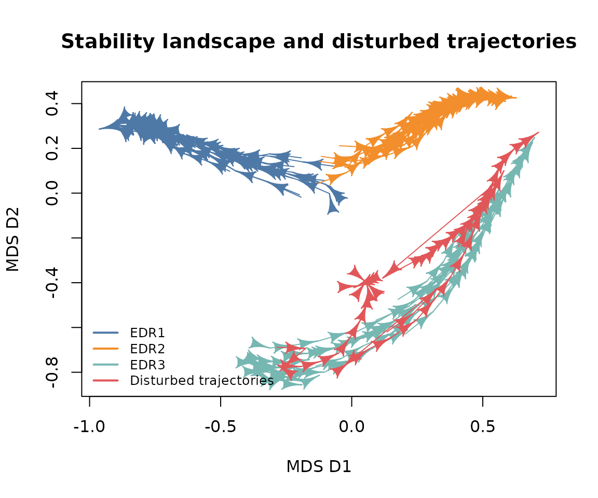

## 3. Assessing ecological dynamic regimes

### 3.1. Identifying the reference ecological dynamic regime

To assess the ecological resilience of a system, we need to identify its
ecological dynamic regime (EDR) so it can be used as the reference to
compare the disturbed dynamics. That is, the EDR to which the disturbed
trajectories belonged before being disturbed. In the figure of the
stability landscape produced for our example data, we can see that the
reference EDR should be EDR3, since all disturbed trajectories are
located in its proximity. However, when we are working with empirical
data, the distinction is often not straightforward.

Given a stability landscape composed of alternative dynamic regimes, we
can compute the dynamic dispersion (dDis) of the **pre-disturbance
portion** of the disturbed trajectories in relation to each alternative
EDR. The function
[`dDis()`](https://mspinillos.github.io/ecoregime/reference/EDR_metrics.md)
allows us to quantify the degree of membership of any trajectory within
an EDR. You can see more information about
[`dDis()`](https://mspinillos.github.io/ecoregime/reference/EDR_metrics.md)
in
[`vignette("EDR_framework")`](https://mspinillos.github.io/ecoregime/articles/EDR_framework.md).

``` r

# Species abundances in pre-disturbance states of the disturbed trajectories
# (Pre-disturbance states are identified by disturbed_states = 0)
abun_predist <- EDR_data$EDR3_disturbed$abundance[disturbed_states == 0] 
selcols <- names(EDR_data$EDR1$abundance)

## EDR1 ------------------------------------------------------------------------

# Species abundances in EDR1 and the predisturbed states of disturbed trajectories
abun1_predist <- rbind(EDR_data$EDR1$abundance, abun_predist[, ..selcols])

# State dissimilarities in EDR1 and the predisturbed states of disturbed trajectories
d1_predist <- vegan::vegdist(x = abun1_predist[, paste0("sp", 1:12)], method = "bray")

# dDis of the disturbed trajectories in relation to EDR1
dDis1 <- sapply(unique(abun_predist$traj), function(ipredist){
  dDis(d = d1_predist, d.type = "dStates", 
       trajectories = abun1_predist$traj, states = abun1_predist$state, 
       reference = as.character(ipredist))
})

## EDR2 ------------------------------------------------------------------------

# Species abundances in EDR2 and the predisturbed states of disturbed trajectories
abun2_predist <- rbind(EDR_data$EDR2$abundance, abun_predist[, ..selcols])

# State dissimilarities in EDR2 and the predisturbed states of disturbed trajectories
d2_predist <- vegan::vegdist(x = abun2_predist[, paste0("sp", 1:12)], method = "bray")

# dDis of the disturbed trajectories in relation to EDR2
dDis2 <- sapply(unique(abun_predist$traj), function(ipredist){
  dDis(d = d2_predist, d.type = "dStates", 
       trajectories = abun2_predist$traj, states = abun2_predist$state, 
       reference = as.character(ipredist))
})

## EDR3 ------------------------------------------------------------------------

# Species abundances in EDR3 and the predisturbed states of disturbed trajectories
abun3_predist <- rbind(EDR_data$EDR3$abundance, abun_predist[, ..selcols])

# State dissimilarities in EDR3 and the predisturbed states of disturbed trajectories
d3_predist <- vegan::vegdist(x = abun3_predist[, paste0("sp", 1:12)], method = "bray")

# dDis of the disturbed trajectories in relation to EDR3
dDis3 <- sapply(unique(abun_predist$traj), function(ipredist){
  dDis(d = d3_predist, d.type = "dStates", 
       trajectories = abun3_predist$traj, states = abun3_predist$state, 
       reference = as.character(ipredist))
})

## Compare dynamic dispersion --------------------------------------------------

# Compare dDis values for the three EDRs
dDis_df <- data.frame(EDR1 = dDis1, EDR2 = dDis2, EDR3 = dDis3)
```

If we compare the values of dDis for each disturbed trajectory (ref. 31,
ref. 32, ref. 33) and EDR (EDR1, EDR2, EDR3), we see that the lowest
dDis values are associated with EDR3. We can take EDR3 as the reference
to assess the ecological resilience of the three disturbed communities.

|                |  EDR1 |  EDR2 |  EDR3 |
|:---------------|------:|------:|------:|
| dDis (ref. 31) | 0.649 | 0.748 | 0.356 |
| dDis (ref. 32) | 0.734 | 0.556 | 0.268 |
| dDis (ref. 33) | 0.711 | 0.436 | 0.412 |

Now, we can “zoom” in the stability landscape to the reference EDR and
the disturbed trajectories. This time, we will use different colors to
distinguish (*i*) the states in the reference EDR, (*ii*) the
pre-disturbance states, and (*iii*) the disturbed states (one color for
each disturbed trajectory).

``` r

# Index of the states in the reference EDR
iref <- which(abun_all$EDR == 3 & is.na(abun_all$disturbed_states))

# Index of the states in disturbed trajectories
idist <- which(!is.na(abun_all$disturbed_states))

# Index of the states in the reference EDR and disturbed trajectories
iref_idist <- c(iref, idist)

# Filter the dissimilarity matrix to select the states of the reference EDR and 
# the disturbed trajectories
d_all <- as.matrix(d_all)
d_EDR3_dist <- d_all[iref_idist, iref_idist]

# Apply mMDS for the new matrix
mds_EDR3_dist <- smacof::mds(d_EDR3_dist, ndim = 3)

# Vector of colors
state.colors <- abun_all[iref_idist, 
                         # color for reference states
                         state.colors := ifelse(is.na(disturbed_states), palette.colors(8, "R4")[8],
                                                # color for pre-disturbance states
                                                ifelse(disturbed_states == 0, palette.colors(8, "R4")[7],
                                                       # color for disturbed states
                                                       ifelse(traj == 31, palette.colors(8, "R4")[2],
                                                              ifelse(traj == 32, palette.colors(8, "R4")[3], 
                                                                     palette.colors(8, "R4")[4]))))]$state.colors
state.colors <- state.colors[!is.na(state.colors)]

# Plot the reference EDR and disturbed trajectories
plot_edr(x = mds_EDR3_dist$conf, 
         trajectories = paste0(abun_all$EDR[iref_idist], "_", abun_all$traj[iref_idist]),
         states = as.integer(abun_all$state[iref_idist]),
         type = "states", # it allows assigning different colors to the states
         state.colors = state.colors,
         xlab = "MDS D1", ylab = "MDS D2",
         main = "Reference EDR and disturbed trajectories")
legend("topleft", c("Reference EDR", "Pre-disturbed states", 
                    "Disturbed states T31", "Disturbed states T32", 
                    "Disturbed states T33"),
       lty = 1, lwd = 2, col = palette.colors(8, "R4")[c(8, 7, 2:4)], 
       cex = 0.9, bty = "n")
```

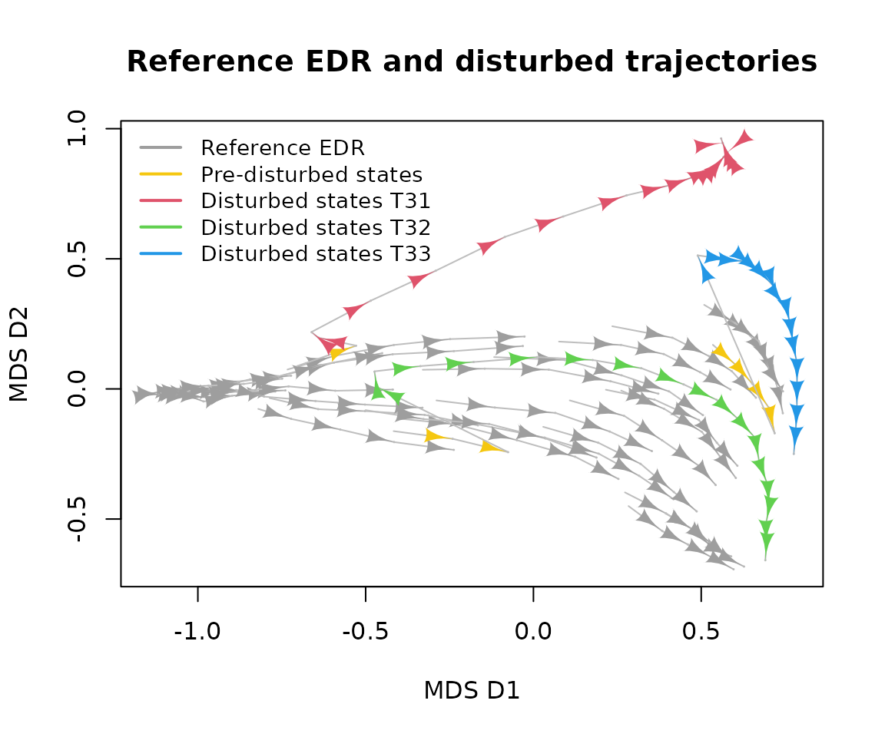

In this figure, we already observe contrasting post-disturbance
dynamics. T32 seems to remain within the boundaries of the EDR, T33
temporarily visits the boundaries before returning towards the reference
EDR, and T31 is pushed out of the EDR. In Section 4, we will learn to
quantify these patterns.

### 3.2. Define the main dynamic trends through representative trajectories

Once we have identified the EDR of reference, we can compute the
representative trajectories using the function
[`retra_edr()`](https://mspinillos.github.io/ecoregime/reference/retra_edr.md).
See
[`vignette("EDR_framework")`](https://mspinillos.github.io/ecoregime/articles/EDR_framework.md)
for more information.

``` r

# State dissimilarities for EDR3 (considering only the undisturbed trajectories)
d_EDR3 <- vegan::vegdist(EDR_data$EDR3$abundance[, paste0("sp", 1:12)])

# Representative trajectories
retra <- retra_edr(d = d_EDR3, 
                   trajectories = EDR_data$EDR3$abundance$traj,
                   states = EDR_data$EDR3$abundance$state, minSegs = 5)
```

Although there are five representative trajectories, we will select “T4”
as the reference for being the longest and covering all regions of the
EDR relatively well.

``` r

# Summarize retra
summary(retra)
#>    ID Size     Length   Avg_link   Sum_link Avg_density Max_density Avg_depth
#> T1 T1    8 0.56912543 0.12435644 0.24871287    7.250000           8  4.750000
#> T2 T2    6 0.39900498 0.10718905 0.21437811    7.666667           8  4.666667
#> T3 T3    4 0.08970149 0.03482587 0.03482587    6.500000           7  6.500000
#> T4 T4   16 1.11654181 0.08961127 0.53766760    6.625000           8  5.125000
#> T5 T5    6 0.35468137 0.08723881 0.17447761    7.333333          10  5.333333
#>    Max_depth
#> T1         6
#> T2         6
#> T3         7
#> T4         7
#> T5         7

# Define T4 as the unique representative trajectory and generate an object of class 'RETRA'
retra_ref <- define_retra(data = retra$T4$Segments, d = d_EDR3, 
                          trajectories = EDR_data$EDR3$abundance$traj, 
                          states = EDR_data$EDR3$abundance$state,
                          retra = retra)
```

``` r

# Plot EDR3 and its representative trajectories
plot(retra, d = d_EDR3, 
     trajectories = EDR_data$EDR3$abundance$traj, 
     states = EDR_data$EDR3$abundance$state, select_RT = "T4",
     xlab = "MDS D1", ylab = "MDS D2",
     main = "Representative trajectories in EDR3")
legend("topleft", c("Representative trajectory 'T4'", 
                    "Other representative trajectories", 
                    "Individual trajectories in EDR3"),
       lty = 1, col = c("red", "black", "grey"), bty = "n")
```

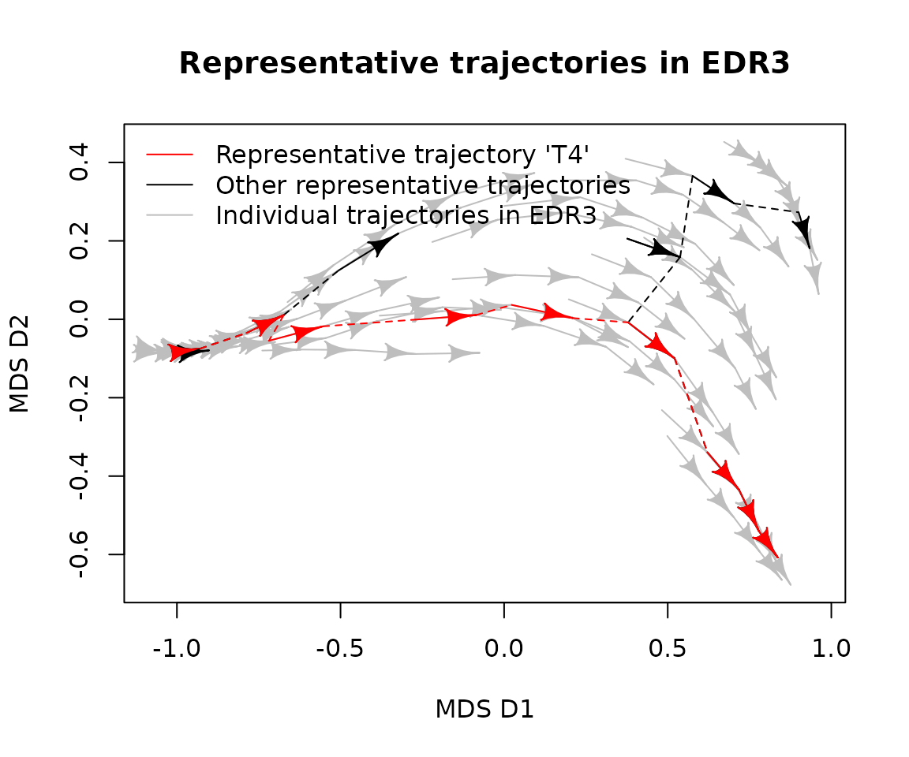

## 4. Metrics of ecological resilience to pulse disturbances

When an ecological system is disturbed, its dynamics can deviate from
the reference EDR and its representative trajectories. Depending on the
immediate impact of the disturbance and the changes in the state
variables following the release of the disturbance, post-disturbance
trajectories can be characterized through four complementary indices:
resistance (*Rt*), amplitude (*A*), recovery (*Rc*), and net change
(*NC*).

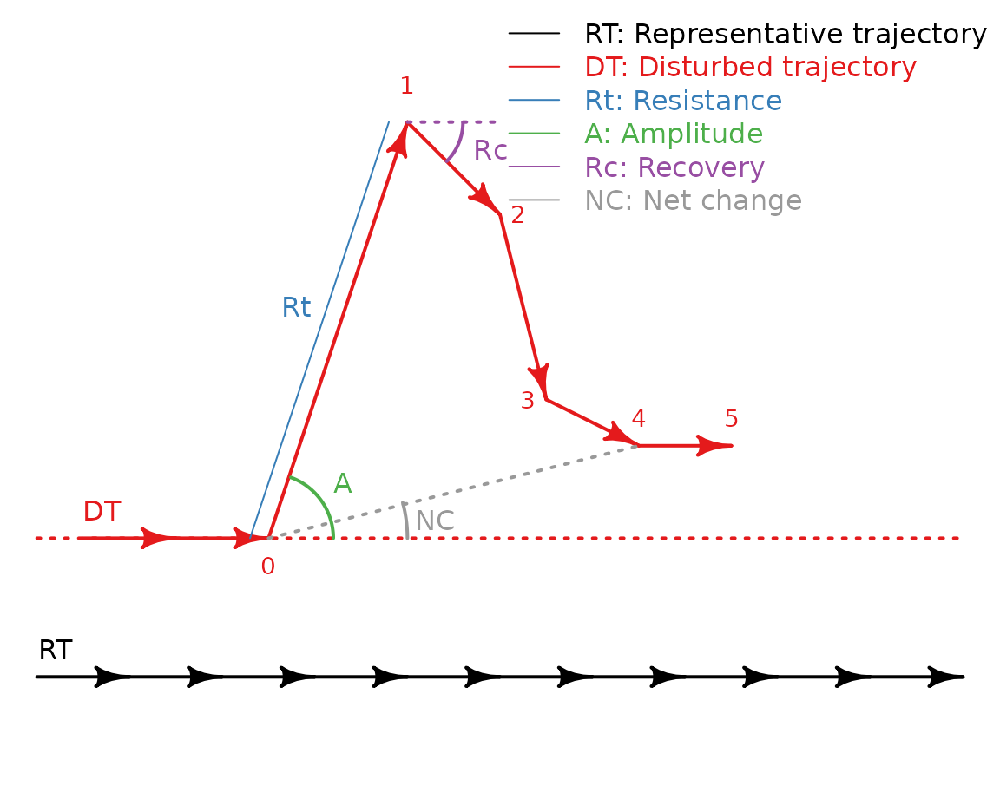

### 4.1. Resistance

The resistance index (*Rt*) quantifies the impact of the disturbance on
the system based on the immediate changes in the state variables. That
is, it is a measure of how similar the disturbed (1) and the
pre-disturbance (0) states are ([Sánchez-Pinillos et al.,
2019](https://doi.org/10.1007/s10021-019-00378-6)). As such, the
resistance index does not depend on the position of the system within
the EDR.

\\Rt = 1 - d\_{pre, dist}\\

where \\d\_{pre,dist}\\ is the dissimilarity between the pre-disturbance
(0) and the disturbed (1) states.

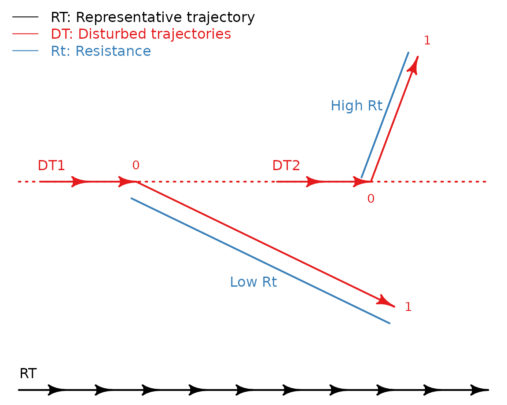

Given the three disturbed trajectories in EDR3 (i.e., `EDR3_disturbed`),
we can compute the resistance index using the function
[`resistance()`](https://mspinillos.github.io/ecoregime/reference/resilience_metrics.md):

``` r

# To calculate resistance, we need a state dissimilarity matrix for the disturbed trajectories
d_disturbed <- vegan::vegdist(EDR_data$EDR3_disturbed$abundance[, paste0("sp", 1:12)], 
                       method = "bray")

# Compute resistance
# Note that the disturbed states are identified by disturbed_states = 1
Rt <- resistance(d = d_disturbed, 
                 trajectories = EDR_data$EDR3_disturbed$abundance$traj, 
                 states = EDR_data$EDR3_disturbed$abundance$state, 
                 disturbed_trajectories = unique(EDR_data$EDR3_disturbed$abundance$traj), 
                 disturbed_states = EDR_data$EDR3_disturbed$abundance[disturbed_states == 1]$state)
```

The three hypothetical systems show a relatively high resistance (close
to 1) to the disturbance:

| Disturbed trajectories |    Rt |
|-----------------------:|------:|
|                     31 | 0.958 |
|                     32 | 0.812 |
|                     33 | 0.693 |

### 4.2. Amplitude

The amplitude (*A*) quantifies how much the system is deviated from its
trajectory during the disturbance assuming that, in the absence of
disturbances, the system would keep a constant distance to a
representative trajectory taken as the reference.

The amplitude can be calculated in absolute terms as the difference of
the dissimilarity between the disturbed state (1) and the representative
trajectory (\\d\_{dist,RT}\\) and the dissimilarity between the
pre-disturbance state (0) and the representative trajectory
(\\d\_{pre,RT}\\):

\\A\_{abs} = d\_{dist,RT} - d\_{pre,RT}\\

Alternatively, the amplitude can be calculated in relation to the impact
of the disturbance (\\d\_{pre,dist}\\). In this case, the amplitude
quantifies the ability of the system to remain close to the
representative trajectory in relation to the changes in the state
variables provoked by the disturbance.

\\A\_{rel} = \frac{d\_{dist,RT} - d\_{pre,RT}}{d\_{pre,dist}}\\

In any case, positive amplitude values indicate that the system is
deviated towards the boundaries of the EDR, whereas negative values
indicate the deviation towards the representative trajectory taken as
the reference.

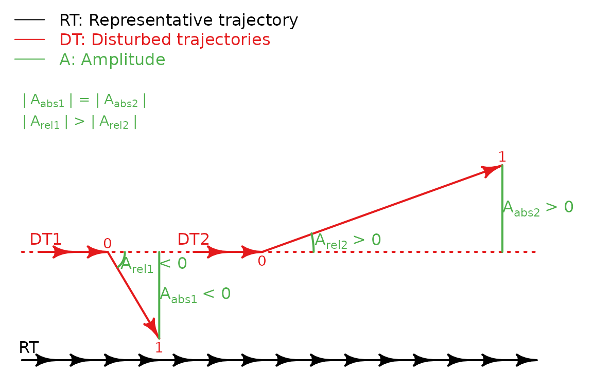

Amplitude can be calculated using the function
[`amplitude()`](https://mspinillos.github.io/ecoregime/reference/resilience_metrics.md):

``` r

# We need a state dissimilarity matrix containing the states of the disturbed 
# trajectories and the representative trajectory taken as the reference
abun <- rbind(EDR_data$EDR3$abundance, EDR_data$EDR3_disturbed$abundance, fill = T)
d <- vegan::vegdist(abun[, paste0("sp", 1:12)], method = "bray")

# Compute amplitude
A <- amplitude(d = d,
               trajectories = abun$traj,
               states = abun$state,
               disturbed_trajectories = abun[disturbed_states == 1]$traj,
               disturbed_states = abun[disturbed_states == 1]$state,
               reference = retra_ref, method = "nearest_state")
```

The three considered systems show positive amplitude values, indicating
that the disturbance lead them towards the boundaries of the EDR.
Whereas the absolute amplitude of trajectory 31 (\\A\_{abs}(31) =
0.027\\) is smaller than the absolute amplitude of trajectory 32
(\\A\_{rel}(32) = 0.119\\), both have similar relative values
(\\A\_{rel}(31) = 0.653\\; \\A\_{rel}(32) = 0.631\\). This result
indicates that despite the small deviation of trajectory 31 from the
representative trajectory during the disturbance, such deviation is
disproportionately high in relation to the impact of the disturbance on
the state variables.

| Disturbed trajectories | Reference | A_(abs) | A_(rel) |
|-----------------------:|:----------|--------:|--------:|
|                     31 | T4.1      |   0.027 |   0.653 |
|                     32 | T4.1      |   0.119 |   0.631 |
|                     33 | T4.1      |   0.268 |   0.871 |

### 4.3. Recovery

The recovery index (*Rc*) quantifies the ability of the system to
reorganize itself after a disturbance and evolve towards the
representative trajectory representing its dominant dynamic trends.

The recovery can be calculated in absolute terms as the difference of
the dissimilarity between the disturbed state (1) and the representative
trajectory (\\d\_{dist,RT}\\) and the dissimilarity between one of the
post-disturbance states (\> 1) and the representative trajectory
(\\d\_{post,RT}\\):

\\Rc\_{abs} = d\_{dist,RT} - d\_{post,RT}\\

Alternatively, the recovery can be calculated in relation to the changes
in the state variables that the system must perform to return towards
the representative trajectory from the disturbed state (\\d\_{dist,
post}\\). In this case, the index penalizes the systems that require
major restructuring of the state variables to return towards the
representative trajectory (positive recovery) and gives less negative
values to the systems minimizing the escape from the dynamic regime
through major changes in its state variables.

\\Rc\_{rel} = \frac{d\_{dist,RT} - d\_{post,RT}}{d\_{dist, post}}\\

Both absolute and relative recovery indices are positive when the system
evolves towards the representative trajectory. Otherwise, negative
values indicate that the system evolves towards the boundaries of the
EDR.

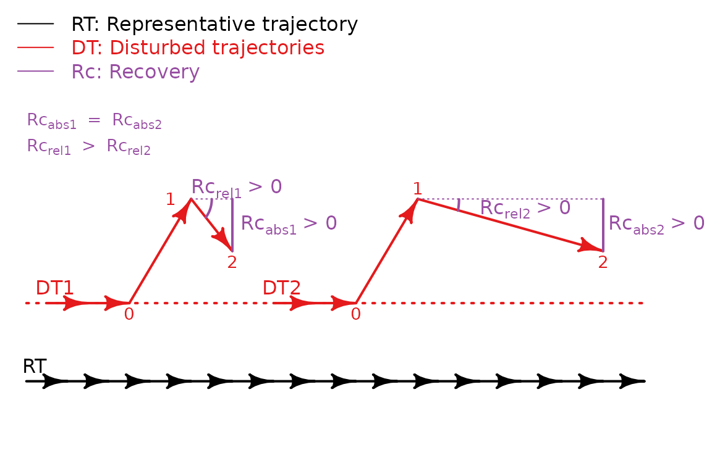

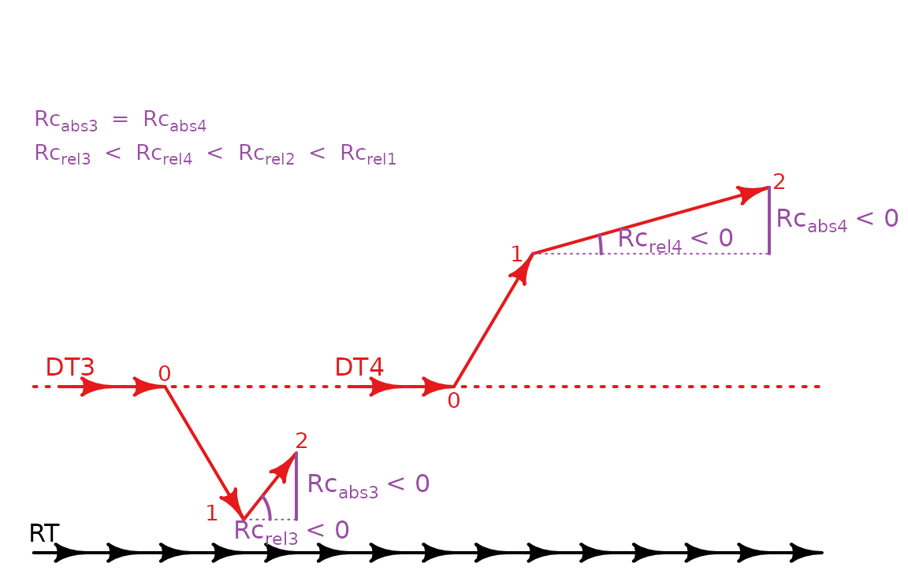

Recovery can be calculated using the function
[`recovery()`](https://mspinillos.github.io/ecoregime/reference/resilience_metrics.md)
considering all states after the disturbed state (\> 1):

``` r

# Compute recovery using the same data used for amplitude
Rc <- recovery(d = d, 
               trajectories = abun$traj,
               states = abun$state, 
               disturbed_trajectories = abun[disturbed_states == 1]$traj,
               disturbed_states = abun[disturbed_states == 1]$state, 
               reference = retra_ref, method = "nearest_state")
```

We can plot the variation of recovery over time considering all
post-disturbance states:

``` r

# Number of states after the disturbed state
Rc <- data.table::data.table(Rc)
Rc[, ID_post := 1:(.N), by = disturbed_trajectories]

par(mfrow = c(1, 2))
# Plot absolute recovery over time
plot(x = range(Rc$ID_post), y = range(Rc$Rc_abs), type = "n",
     xlab = "Nb. states after disturbance", ylab = "Absolute recovery",
     main = "Variation of absolute recovery")
for (i in unique(Rc$disturbed_trajectories)) {
  lines(Rc[disturbed_trajectories == i, c("ID_post", "Rc_abs")],
        col = which(unique(Rc$disturbed_trajectories) %in% i) + 1)
}
legend("bottomleft", legend = unique(Rc$disturbed_trajectories), lty = 1, 
       col = seq_along(unique(Rc$disturbed_trajectories)) + 1, bty = "n")

# Plot relative recovery over time
plot(x = range(Rc$ID_post), y = range(Rc$Rc_rel), type = "n",
     xlab = "Nb. states after disturbance", ylab = "Relative recovery",
     main = "Variation of relative recovery")
for (i in unique(Rc$disturbed_trajectories)) {
  lines(Rc[disturbed_trajectories == i, c("ID_post", "Rc_rel")],
        col = which(unique(Rc$disturbed_trajectories) %in% i) + 1)
}
legend("topright", legend = unique(Rc$disturbed_trajectories), lty = 1, 
       col = seq_along(unique(Rc$disturbed_trajectories)) + 1, bty = "n")
```

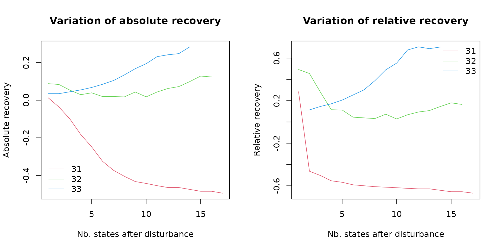

### 4.4. Net change

Net change (*NC*) quantifies how much the system is deviated from its
trajectory after the release of the disturbance assuming that, in the
absence of disturbances, the system would keep a constant distance to a
representative trajectory taken as the reference.

Like amplitude and recovery, net change can be calculated in absolute or
relative terms. The absolute net change is expressed as the difference
of the dissimilarity between one of the post-disturbance states (\> 1)
and the representative trajectory (\\d\_{post,RT}\\) and the
dissimilarity between the pre-disturbance state (0) and the
representative trajectory (\\d\_{pre,RT}\\):

\\NC\_{abs} = d\_{post,RT} - d\_{pre,RT}\\

The relative net change is calculated in relation to the changes
produced in the state variables between the pre-disturbance and the
post-disturbance states (\\d\_{pre,post}\\). In this way, the index
penalizes the systems that deviated from the expected trajectory despite
being very similar to the pre-disturbance state.

\\NC\_{rel} = \frac{d\_{post,RT} - d\_{pre,RT}}{d\_{pre,post}}\\

As in the amplitude index, positive values indicate that the system is
deviated towards the boundaries of the EDR and negative values indicate
the deviation towards the representative trajectory taken as the
reference.

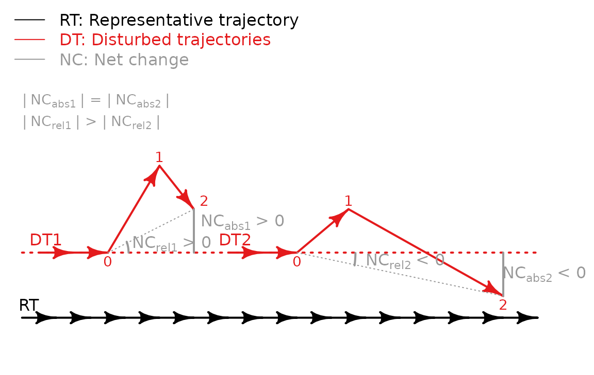

The function
[`net_change()`](https://mspinillos.github.io/ecoregime/reference/resilience_metrics.md)
included in `ecoregime` can be used to calculate the net change of all
post-disturbance states in relation to the pre-disturbance state:

``` r

# Compute net change using the same data used for amplitude
NC <- net_change(d = d, 
                 trajectories = abun$traj,
                 states = abun$state,
                 disturbed_trajectories = abun[disturbed_states == 1]$traj,
                 disturbed_states = abun[disturbed_states == 1]$state,
                 reference = retra_ref, method = "nearest_state")
```

We can plot the variation of net change over time considering all
post-disturbance states:

``` r

# ID post-disturbance states
NC <- data.table::data.table(NC)
NC[, ID_post := 1:(.N), by = disturbed_trajectories]

par(mfrow = c(1, 2))
# Plot absolute net change over time
plot(x = range(NC$ID_post), y = range(NC$NC_abs), type = "n",
     xlab = "Nb. states after disturbance", ylab = "Absolute net change",
     main = "Variation of absolute net change")
for (i in unique(NC$disturbed_trajectories)) {
  lines(NC[disturbed_trajectories == i, c("ID_post", "NC_abs")],
        col = which(unique(NC$disturbed_trajectories) %in% i) + 1)
}
legend("topleft", legend = unique(NC$disturbed_trajectories), lty = 1, 
       col = seq_along(unique(NC$disturbed_trajectories)) + 1, bty = "n")

# Plot relative net change over time
plot(x = range(NC$ID_post), y = range(NC$NC_rel), type = "n",
     xlab = "Nb. states after disturbance", ylab = "Relative net change",
     main = "Variation of relative net change")
for (i in unique(NC$disturbed_trajectories)) {
  lines(NC[disturbed_trajectories == i, c("ID_post", "NC_rel")],
        col = which(unique(NC$disturbed_trajectories) %in% i) + 1)
}
legend("bottomleft", legend = unique(NC$disturbed_trajectories), lty = 1, 
       col = seq_along(unique(NC$disturbed_trajectories)) + 1, bty = "n")
```

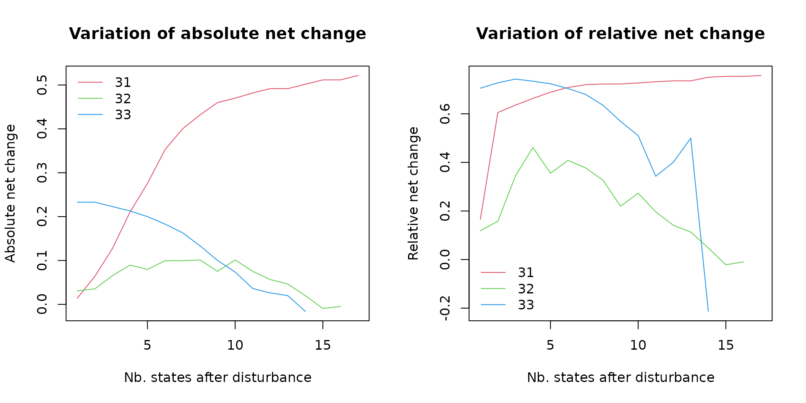

## 5. Assessing the ecological resilience of systems affected by pulse disturbances

Altogether, the metrics of amplitude, recovery, and net change define
the geometry of disturbed trajectories in relation to the reference EDR.
Additionally, the resistance index helps interpret the response of the
system considering the immediate impact of the disturbance.

As an example, we will take the three disturbed trajectories used in the
previous section. For simplicity, we will only focus on resistance and
the absolute values of amplitude, recovery, and net change and we will
consider the 14th post-disturbance state (last post-disturbance state of
*Trajectory 33*) of all trajectories to calculate recovery and net
change.

``` r

# Merge the results for resistance, amplitude, recovery, and net change
results <- Reduce(function(x, y) merge(x, y, all = T),
                  list(Rt, A, Rc, NC))
results <- results[which(results$ID_post == 14), 
                   c("disturbed_trajectories", "Rt", "A_abs", "Rc_abs", "NC_abs")]
```

| Disturbed trajectories |    Rt | A_(abs) | Rc_(abs) | NC_(abs) |
|-----------------------:|------:|--------:|---------:|---------:|
|                     31 | 0.958 |   0.027 |   -0.474 |    0.502 |
|                     32 | 0.812 |   0.119 |    0.099 |    0.020 |
|                     33 | 0.693 |   0.268 |    0.283 |   -0.016 |

Based on the values of the indices, we can figure out the shape of the
disturbed trajectories. For example, *Trajectory 31* was very resistant
to the immediate impact of the disturbance (in terms of changes in the
state variables) (\\Rt = 0.958\\) and the amplitude provoked by the
disturbance was very small (\\A = 0.027\\). However, unlike *Trajectory
32* and *Trajectory 33*, the recovery was negative (\\Rc = -0.474\\) and
the net change positive and relatively high (\\NC = 0.502\\). Thus,
despite the relatively low impact of the disturbance, the values of
recovery and net change indicate that *Trajectory 31* goes away from the
reference EDR and the system potentially changes to an alternative
dynamic regime.

Both *Trajectory 32* and *Trajectory 33* showed positive values of
recovery and net change values close to zero. In both cases, amplitude
and recovery have similar values, respectively (*Trajectory 32:* \\A =
0.119\\, \\Rc = 0.099\\; *Trajectory 33:* \\A = 0.268\\, \\Rc =
0.283\\), indicating that these systems are able to reorganize and
remain within the EDR.

*Trajectory 32* was relatively resistant to the impact of the
disturbance (\\Rt = 0.812\\) and showed a relatively low deviation from
the representative trajectory (\\A = 0.119\\). In contrast, *Trajectory
33* was more severely impacted by the disturbance (\\Rt = 0.693\\; \\A =
0.268\\) but showed a high recovery capacity (\\Rc = 0.283\\). Thus,
while both communities could be considered resilient, they showed
different strategies. Whereas *Trajectory 32* represents a resistant
dynamic within the EDR, *Trajectory 33* represents a more variable
system whose dynamics visit the borders of the EDR to eventually return
towards the representative trajectory.

To support our evaluation of the ecological resilience of disturbed
trajectories, we can calculate the dynamic dispersion (dDis) of the
post-disturbance portion of the disturbed trajectories in relation to
the trajectories in the EDR.

``` r

# Species abundances in post-disturbance states of the disturbed trajectories
# The states after the release of the disturbance are identified by disturbed_states > 1
abun_post <- EDR_data$EDR3_disturbed$abundance[disturbed_states > 1] 
selcols <- names(EDR_data$EDR3$abundance)

# Species abundances in EDR3 and the post-disturbance states of disturbed trajectories
abun3_post <- rbind(EDR_data$EDR3$abundance, abun_post[, ..selcols])

# State dissimilarities in EDR3 and the post-disturbance states of disturbed trajectories
d3_post <- as.matrix(vegan::vegdist(x = abun3_post[, paste0("sp", 1:12)], method = "bray"))

# dDis of each disturbed trajectory
dDis_dist <- sapply(unique(abun_post$traj), function(idist){
  rm_disturbed <- unique(abun_post$traj[which(abun_post$traj != idist)])
  irm <- which(abun3_post$traj %in% rm_disturbed)
  dDis(d = d3_post[-irm, -irm], d.type = "dStates", 
       trajectories = abun3_post$traj[-irm], 
       states = abun3_post$state[-irm], 
       reference = as.character(idist))
})
```

The values of dDis confirm the resilience of *Trajectory 32* and show
that, despite being able to recover after the disturbance, the dynamic
represented by *Trajectory 33* is anomalous in relation to the other
dynamics in the EDR.

| Disturbed trajectories |  dDis |
|-----------------------:|------:|
|                     31 | 0.463 |
|                     32 | 0.257 |
|                     33 | 0.474 |

Finally, we can illustrate the responses of the three disturbed
communities by representing their trajectories in relation to the
reference EDR and its representative trajectory:

``` r

# Plot EDR3 and its representative trajectories
plot(retra_ref, d = d, 
     trajectories = abun$traj, 
     states = abun$state, 
     traj.colors = c(rep("grey", 30), 2:4), 
     xlab = "MDS D1", ylab = "MDS D2",
     main = "Comparison of disturbed trajectories and EDR3")
legend("topleft", c("Representative trajectory", 
                    "Individual trajectories in EDR3",
                    "Trajectory 31",
                    "Trajectory 32",
                    "Trajectory 33"),
       lty = 1, col = c("black", "grey", 2:4), bty = "n")
```

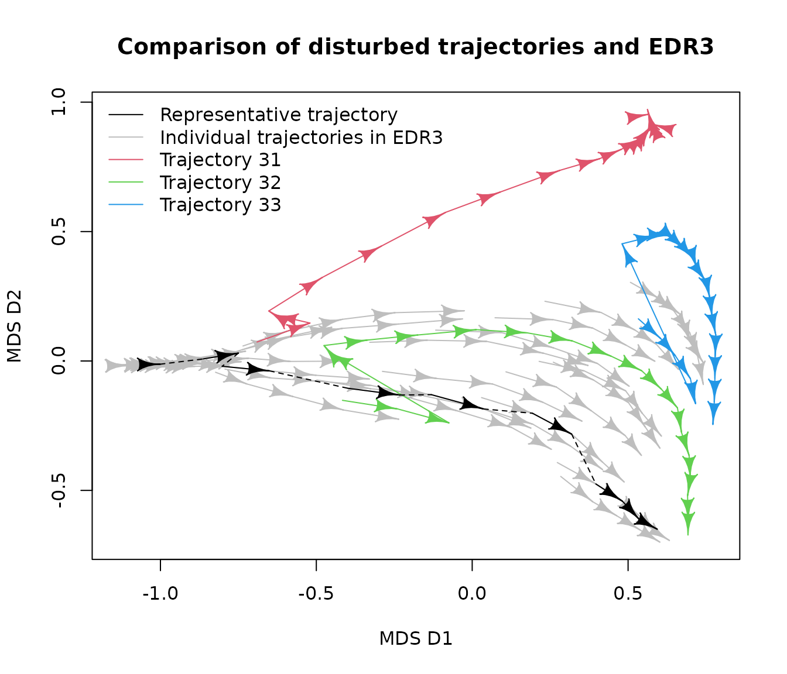

## Acknowledgements

This project has received funding from the European Union’s Horizon 2020
research and innovation program under the Marie Sklodowska-Curie grant
agreement No 891477 (RESET project).
